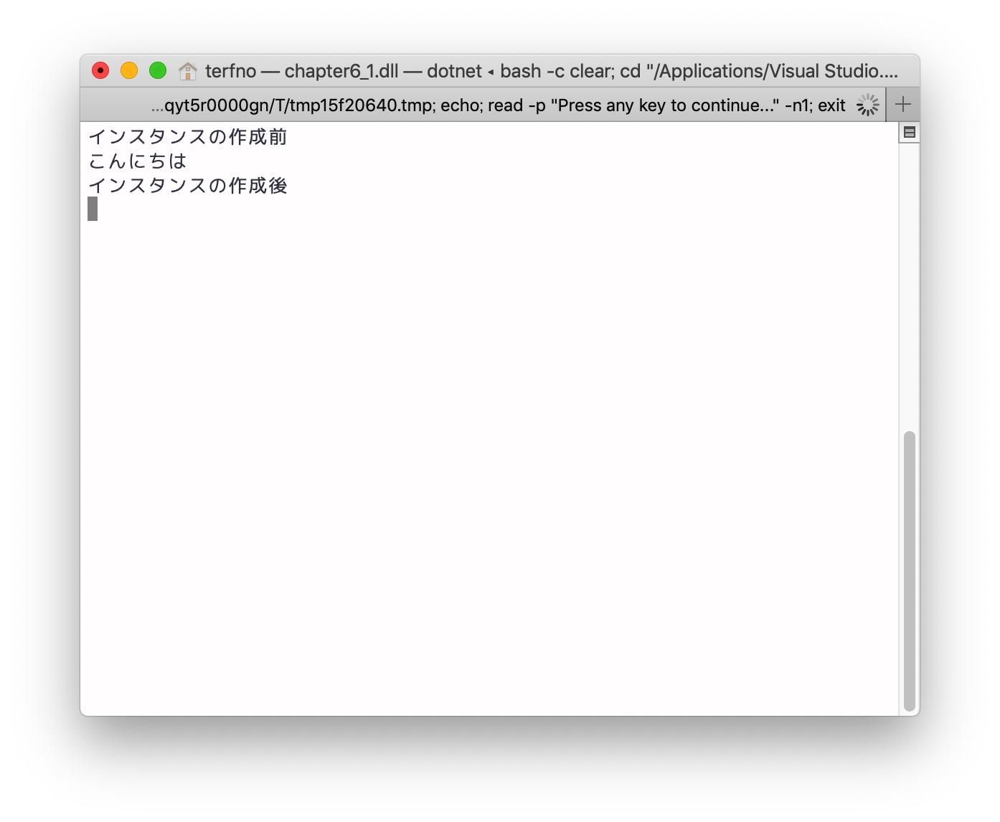
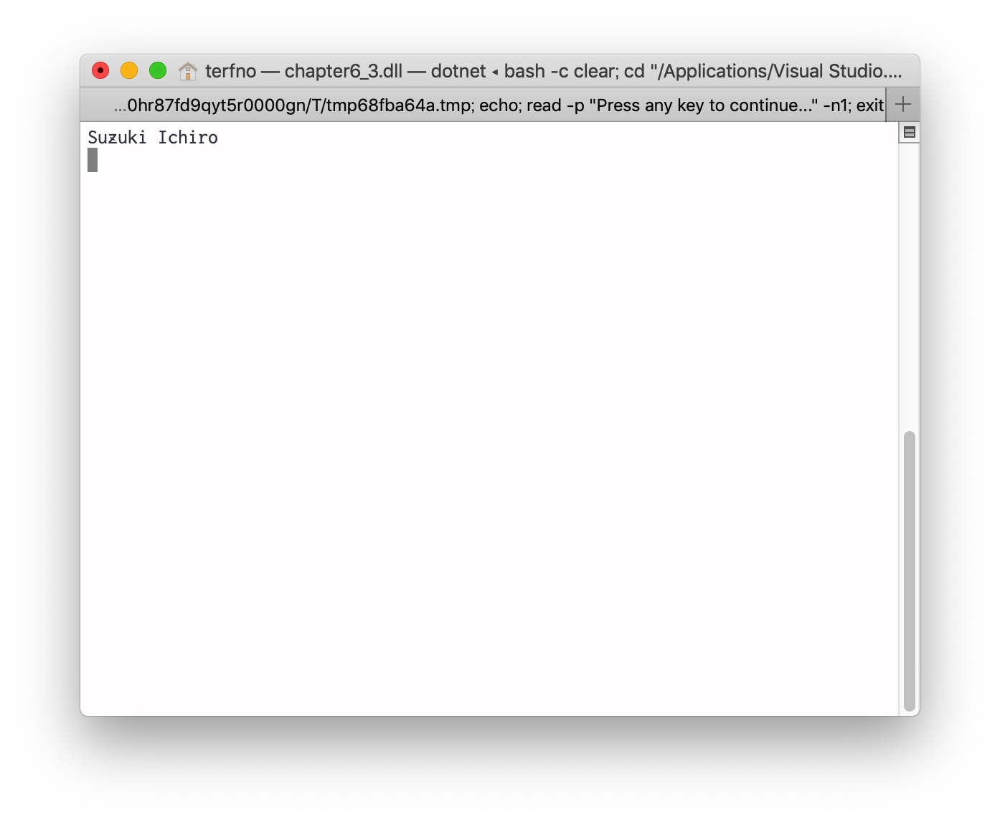
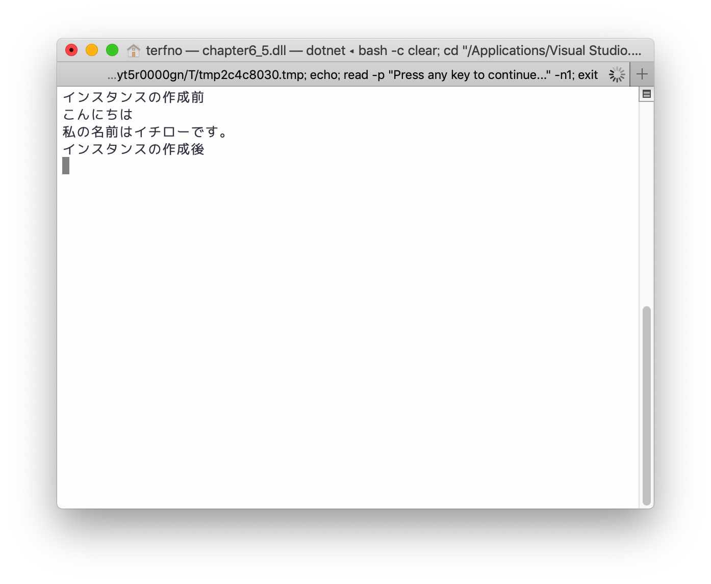
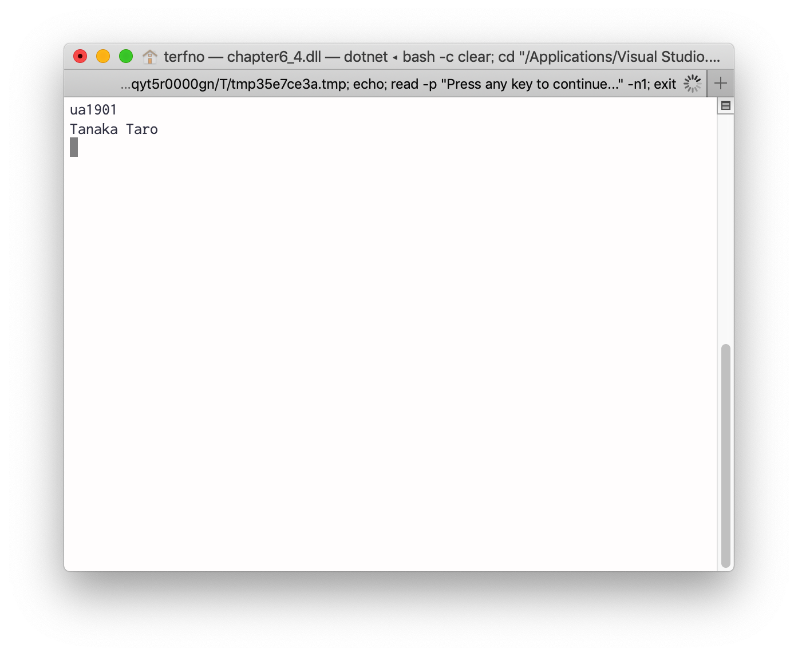
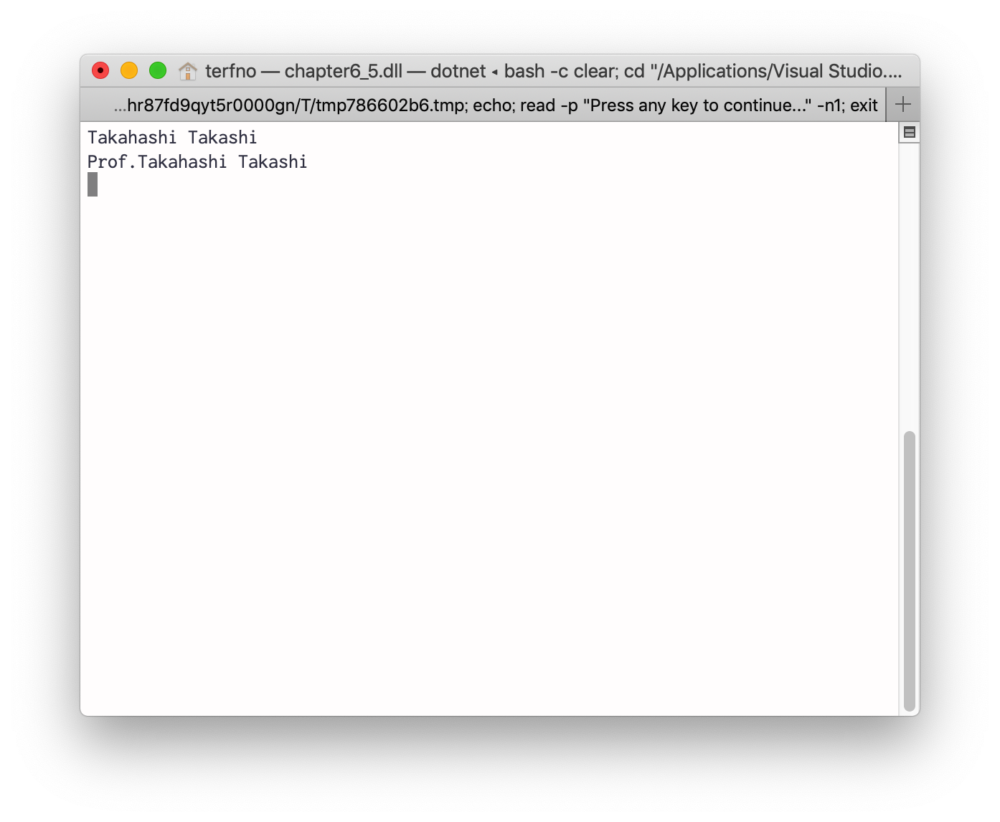
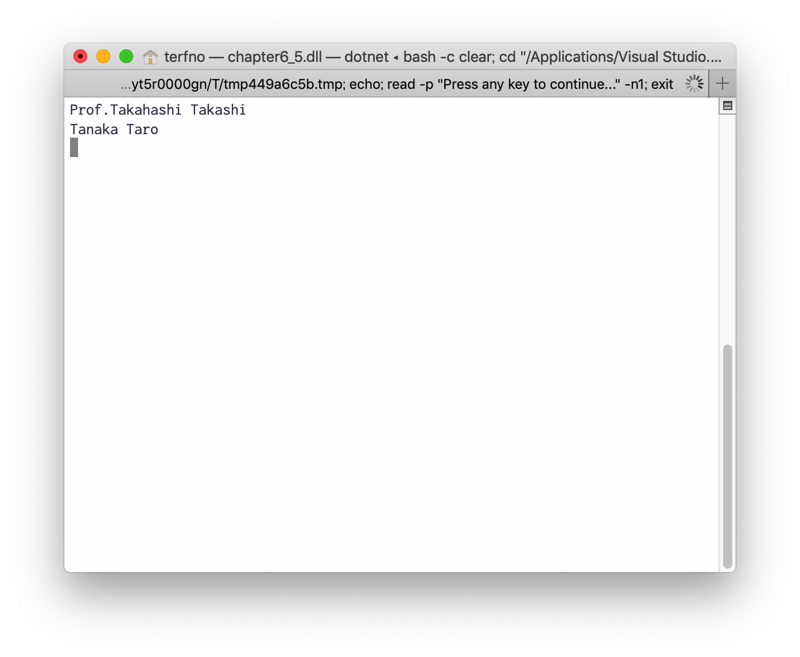
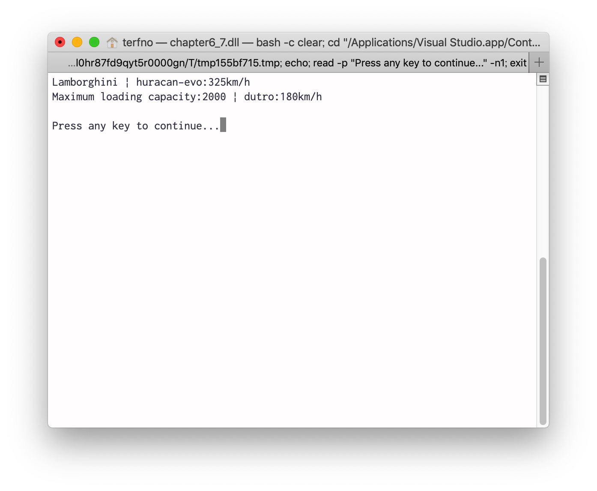

# 2019/05/24 
<style>
    .c{
        text-align:center;
    }
</style>

## 目的
この演習ではオブジェクト指向プログラミングの基礎であるクラスの継承について学ぶ。

## 装置/ツール
* Visual Studio
* MacBook Pro

## 実験
### 問題6.1
> 実験書図6.1を実行し実行結果をスクリーンショットで報告しなさい。

実行結果を図6.1に示す。

<div class="c">図6.1 実行結果</div>

### 問題6.2
> 実験書6.13を実行し、スクリーンショットを報告しなさい。

実行結果を図6.2に示す。

<div class="c">図6.2 実行結果</div>

### 問題6.3
> 実験書図6.5のプログラムを実行し、コンストラクタの実行順序を確認した上でスクリーンショットを報告しなさい。

実行結果を図6.3に示す。

<div class="c">図6.3 実行結果</div>

### 問題6.4
> 実験書図6.8のプログラムに図6.13のUserクラスを追加し、図6.9のようにMain関数から実行しなさい。またソースコードとスクリーンショットを報告しなさい。また、GetIDメソッドが返すIDのルールを説明しなさい。

ソースコードを図6.4.1に示す。
```cs
using System;

namespace chapter6_4
{
    class User
    {
        private string familyName;
        private string firstName;

        public User(string familyName, string firstName)
        {
            this.familyName = familyName;
            this.firstName = firstName;
        }

        public string GetUserName()
        {
            return familyName + " " + firstName;
        }
    }

    class Student : User
    {
        private string studentID;
        private int entryYear;
        private int no;

        public Student(int no, int entryYear, string familyName, string firstName) : base(familyName, firstName)
        {
            this.no = no;
            this.entryYear = entryYear;
            this.studentID = "u" + firstName[1].ToString() + (entryYear - 100 * (entryYear / 100)).ToString() + string.Format("{0:00}", no);
        }

        public string GetID()
        {
            return this.studentID;
        }
    }

    class Terminal
    {
        public static void Main(string[] args)
        {
            Student s = new Student(1, 2019, "Tanaka", "Taro");

            Console.WriteLine(s.GetID());
            Console.WriteLine(s.GetUserName());
            Console.ReadKey();
        }
    }
}

```
<div class="c">図6.4.1 ソースコード</div>

実行結果を図6.4.2に示す。

<div class="c">図6.4.2 実行結果</div>

#### GetIDメソッドのルール
ユーザーIDは最初の文字として`u`、次に下の名前をローマ字表記した場合の前から二文字目を2文字目として(今回であればTanaka Taroなので`a`)、そこから入学年の下2桁(今回であれば2019なので`19`)を、最後に出席番号を{0:00}でフォーマットし(今回であれば1番なので0埋めして`01`)を付け加えたものがIDとなる。今回は`ua1901`だが、例えば出席番号17番、入学年2016年のSueda Takahitoであれば、`ua1617`となる。

### 問題6.5
> 実験書図6.11および6.12を実行し、実行結果をスクリーンショットで報告しなさい。また、図6.13および図6.14の改変を加えたプログラムを実行しソースコードと実行結果を報告しなさい。また、実行結果の違いを説明しなさい。

実験書図6.11および実験書図6.12の実行結果を図6.5.1に示す。

<div class="c">図6.5.1 実行結果</div>

また、改変を加えたプログラムの実行結果を図6.5.2に示す。

<div class="c">図6.5.2 実行結果</div>

ソースコードを図6.5.3に示す。
```cs
using System;

namespace Record
{
    class User
    {
        private string familyName;
        private string firstName;

        public User(string familyName, string firstName)
        {
            this.familyName = familyName;
            this.firstName = firstName;
        }

        public virtual string GetUserName()
        {
            return familyName + " " + firstName;
        }
    }

    class Teacher : User
    {
        private string yakushoku;
        public Teacher(string yakushoku, string familyName, string firstName) : base(familyName, firstName)
        {
            this.yakushoku = yakushoku;
        }

        public override string GetUserName()
        {
            return this.yakushoku + base.GetUserName();
        }
    }

    class Program
    {
        public static void Main(string[] args)
        {
            Teacher t = new Teacher("Prof.", "Takahashi", "Takashi");
            User u = t;

            Console.WriteLine(u.GetUserName());
            Console.WriteLine(t.GetUserName());
            Console.ReadKey();
        }
    }
}

```
<div class="c">図6.5.3 ソースコード</div>
<br>

親クラスのGetUserNameメソッドをvirtualにすることで各子クラスでoverrideすることができるようになった。

### 問題6.6
> 問題6.5の改変後にStudentクラスを追加し図6.15のように実行しなさい。また、他体制の観点から動作がどのように異なるか説明しなさい。

実行結果を図6.6に示す。

<div class="c">図6.6 実行結果</div>

小クラスの先生の方は多態性の恩恵によって`Prof.`が追加されているが、Studentの方はoverrideしていないので普通に名前が表示されている。

### 問題6.7
> 具体的な概念と会の概念を各自独自に考え、プログラムとして実行しなさい。そのソースコードと実行結果のスクリーンショットで報告しなさい。

車という概念からスーパーカーとトラックを派生させた。
ソースコードを図6.7.1に示す。
```cs
using System;

namespace chapter6_7
{
    class Car
    {
        private string carName;
        private int maxSpeed;

        public Car(string carName,int maxSpeed)
        {
            this.carName = carName;
            this.maxSpeed = maxSpeed;
        }

        public virtual string GetInfo()
        {
            return carName + ":" + maxSpeed.ToString() + "km/h";
        }
    }

    class BrandCar : Car
    {
        private string brand; //e.g. Lamborghini, Ferrari

        public BrandCar(string brand, string carName, int maxSpeed) : base(carName, maxSpeed)
        {
            this.brand = brand;
        }

        public override string GetInfo()
        {
            return this.brand + " | " + base.GetInfo();
        }
    }

    class Track : Car
    {
        private int maxLC; //Maximum loading capacity

        public Track(int maxLC, string carName, int maxSpeed) : base(carName, maxSpeed)
        {
            this.maxLC = maxLC;
        }

        public override string GetInfo()
        {
            return "Maximum loading capacity:" + maxLC + " | " + base.GetInfo();
        }
    }

    class Program
    {
        public static void Main(string[] args)
        {
            BrandCar b = new BrandCar("Lamborghini", "huracan-evo", 325);
            Track t = new Track(2000, "dutro", 180);
            Car c1 = b;
            Car c2 = t;

            Console.WriteLine(c1.GetInfo());
            Console.WriteLine(c2.GetInfo());

            Console.ReadKey();
        }
    }
}

```
<div class="c">図6.7.1 ソースコード</div>

実行結果を図6.7.2に示す。

<div class="c">図6.7.2 実行結果</div>

## 課題
### 課題6.1
> クラス図の書き方について調べ、問題6.6のクラス構造について図示し、ソースコードの対応関係も含めて具体的に説明しなさい。

### 課題6.2
> なぜ、多態性によって結合度が低下し凝集度が高まるのか説明しなさい。

name + value