# 2019/04/12 プログラミング演習
<style>
    .center{
        text-align:center;
    }
</style>

## 目的
この演習においては、オブジェクト指向プログラミングや、IDEを使ったデバッグ・プロファイリングを学ぶ。

## 装置
* 学校のPC
* MacBook Pro(私物)

## 実験
### 問題1.1
>実験書1.2節の箇条書きに則って、表1.1に示すソリューションを作成し、図1.1のソースコードを入力して、実験結果をスクリーンショットで示せ。
<div class="center">表1.1 ソリューション</div>

| 項目           | 値         |
| -------------- | ---------- |
| 名前           | chapter1_1 |
| 場所           | デフォ     |
| ソリューション | chapter1   |

ソースコードを図1.1に示す。

```cs
using System;

namespace chapter1_1
{
    class Program
    {
        static void Main(string[] args)
        {
            Console.WriteLine("Hello World!" + "Takahito Sueda");
            Console.ReadKey();
        }
    }
}

```
<div class="center">図1.1 Hello World</div>

実行結果を図1.1.1に示す。
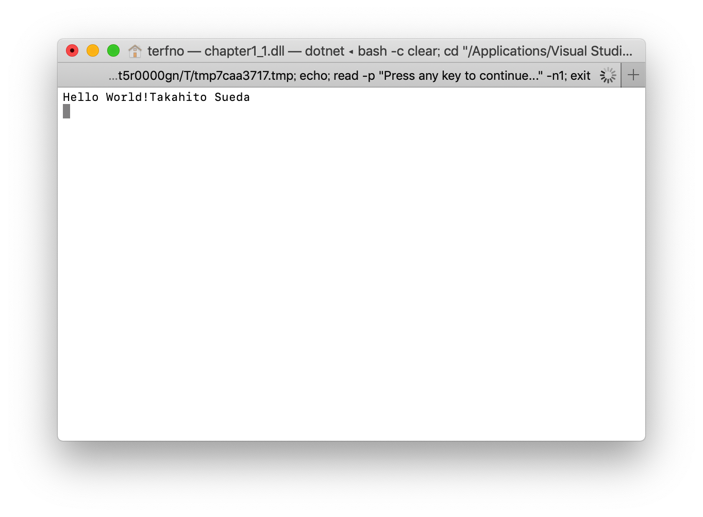
<div class="center">図1.1.1 Hello World</div>

### 問題1.2
>1.2節の箇条書きに則って、図1.2のソースコードを入力して、実行結果をスクリーンショットで示せ。また、1との動作の違いを説明しなさい。

ソースコードを図1.2に示す。
```cs
using System;

namespace chapter1_2
{
    class Program
    {
        static void Main(string[] args)
        {
            System.Diagnostics.Debug.WriteLine("Hello World!" + "Takahito Sueda");
        }
    }
}

```
<div class="center">図1.2 Debug.WriteLine</div>

実行結果のうち、Terminalの結果を図1.2.1に、VS上での実行結果を図1.2.2に示す。

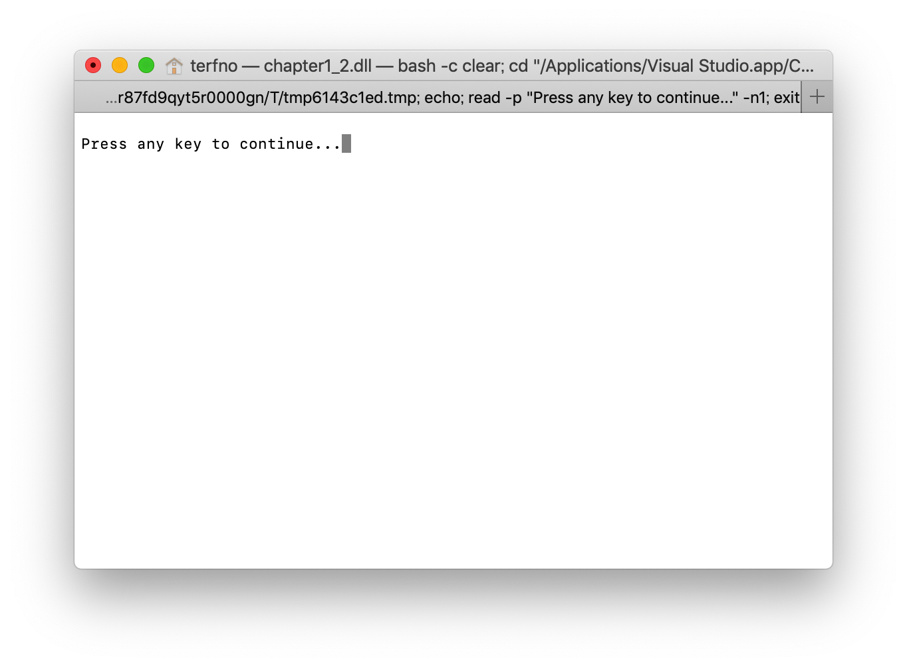
<div class="center">図1.2.1 terminal</div>

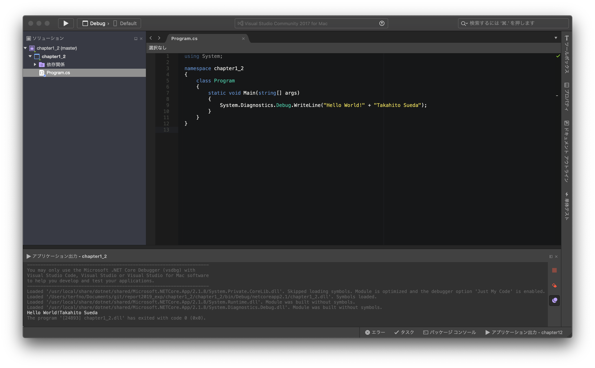
<div class="center">図1.2.2 Visual Studio</div>

<br>
Debugとして出力するので、デフォルトの出力先ではなく開発者の見えるVSに出力されている。

### 問題1.3
>実験書の図1.5、1.6のソースコードを問題1.1のMainメソッドの先頭に追加し、またエラーを取り除いて、実行結果をスクリーンショットで報告しなさい。

ソースコードを図1.3に示す。
```cs
using System;

namespace chapter1_1
{
    class Program
    {
        static void Main(string[] args)
        {
            // 図1.5
            int a = 1, b = 2, c = 3, d = 4, e = 5, f = 6;
            Console.WriteLine(a + b);
            Console.WriteLine(b - c);
            Console.WriteLine(c * d);
            Console.WriteLine(d / e);
            Console.WriteLine(e % f);

            // 図1.6
            double de = 5.0;
            Console.WriteLine(d / (int)de);
            Console.WriteLine(d / de);
            //Console.WriteLine((bool)42); ←boolへの変換でエラー。コメントアウトで解決

            Console.WriteLine("Hello World!" + "Takahito Sueda");
            Console.ReadKey();
        }
    }
}

```
<div class="center">図1.3 四則演算と型キャスト</div>

<br>

実行結果を図1.3.1に示す。
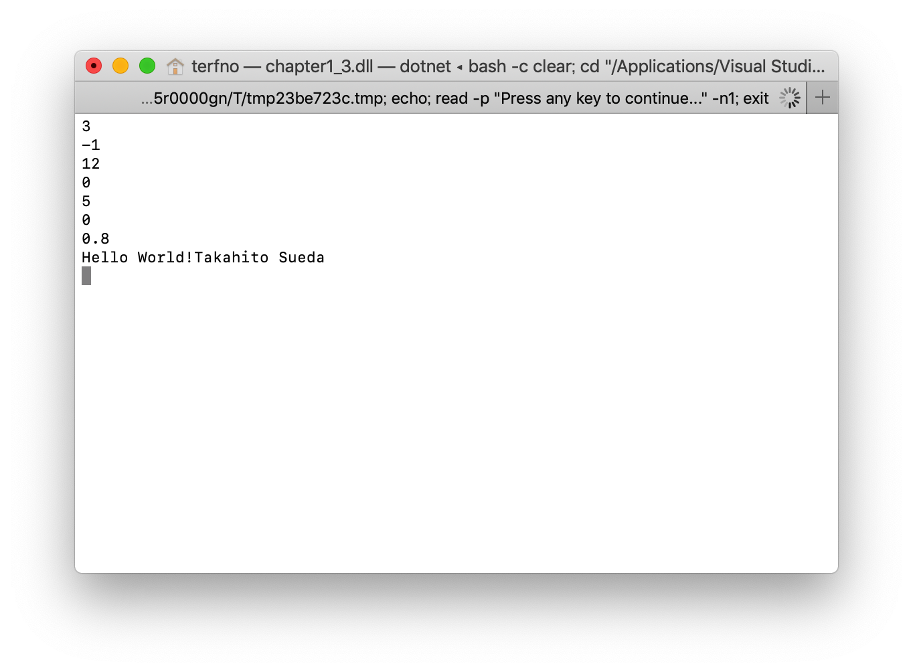
<div class="center">図1.3.1 各演算の実行結果</div>

### 問題1.4
> 実験書の図1.13で本来想定されている処理結果を、実現しなさい。

ソースコードを図1.4に示す。
```cs
using System;

namespace chapter1_4
{
    class Program
    {
        static void Main(string[] args)
        {
            string s4 = "しぶいおちゃ";

            Console.WriteLine(s4);

            s4 = s4.Remove(1, 1);
            s4 = s4.Insert(1, "ろ");
            s4 = s4.Remove(5, 1);
            s4 = s4.Insert(5, "ば");

            Console.WriteLine(s4);
            Console.ReadKey();
        }
    }
}

```
<div class="center">図1.4 文字のおきかえ</div>
<br>

実行結果を図1.4.1に示す。
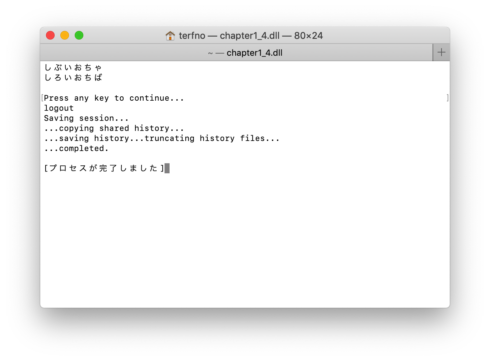
<div class="center">図1.4.1 文字の置き換え前と後</div>

### 問題1.4.a
> 追加問題
> 実験書図1.7のプログラムを実行し、実行結果をスクリーンショットで報告しなさい。

ソースコードを図1.4.aに示す。
```cs
using System;

namespace chapter1_4_a
{
    class Program
    {
        static void Main(string[] args)
        {
            int[] a = new int[3];
            int[] b = a;
            Console.WriteLine(b[2]);

            a[2] = 42;
            Console.WriteLine(b[2]);
        }
    }
}

```
<div class="center">図1.4.a 配列</div>
<br>

実行結果を図1.4.a.1に示す。

<div class="center">図1.4.a.1 </div>

### 問題1.5
> 問題番号のプロジェクトを追加し、実験書の図1.14と1.15のプログラムを作成し、実行結果をスクリーンショットで示せ。

ソースコードを図1.5に示す。
```cs
using System;

namespace chapter1_5
{
    class Program
    {
        static void Main(string[] args)
        {
            string input = "";

            for (int i = 0; i < 6; i++)
            {
                input = Console.ReadLine();

                // 図1.14
                if (input.Length >= 10)
                {
                    Console.WriteLine("10文字以上");
                }
                else if (input.Length < 5)
                {
                    Console.WriteLine("5文字未満");
                }
                else
                {
                    Console.WriteLine("5文字以上10文字未満");
                }

                // 図1.15
                switch (input.Length)
                {
                    case 5:
                        Console.WriteLine("5文字ちょうど");
                        break;
                    case 10:
                        Console.WriteLine("10文字ちょうど");
                        break;
                    default:
                        Console.WriteLine("5文字でも10文字でもない");
                        break;
                }
            }

            Console.ReadKey();
        }
    }
}

```
<div class="center">図1.5 ifとswitch</div>
<br>

実行結果を図1.5.1に示す。
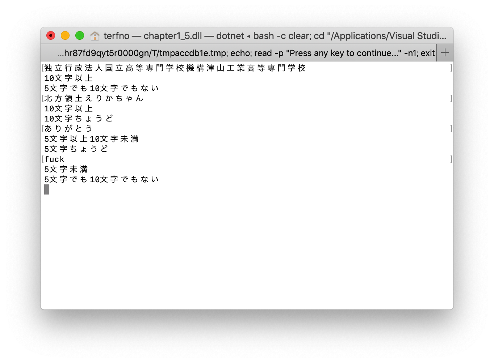
<div class="center">図1.5.1 各分岐の実行結果</div>

### 問題1.6
>問題番号のプロジェクトを追加し、条件分岐文を駆使して、電卓を作れ。

ソースコードを図1.6に示す。
```cs
using System;

namespace chapter1_6
{
    class Program
    {
        static void Main(string[] args)
        {
            Console.WriteLine("値1(整数)を入力してください");
            string value1 = Console.ReadLine();
            int v1 = int.Parse(value1);

            Console.WriteLine("演算子(+,-,*,/)を入力してください");
            string cal = Console.ReadLine();

            Console.WriteLine("値2(整数)を入力してください");
            string value2 = Console.ReadLine();
            int v2 = int.Parse(value2);

            Console.WriteLine("答えは…");

            switch (cal)
            {
                case "+":
                    Console.WriteLine(v1 + v2);
                    break;
                case "-":
                    Console.WriteLine(v1 - v2);
                    break;
                case "*":
                    Console.WriteLine(v1 * v2);
                    break;
                case "/":
                    Console.WriteLine(v1 / v2);
                    break;
                default:
                    Console.WriteLine("error");
                    break;
            }

            Console.ReadKey();
        }
    }
}

```
<div class="center">図1.6 簡易計算機</div><br>

実行結果を図1.6.1に示す。
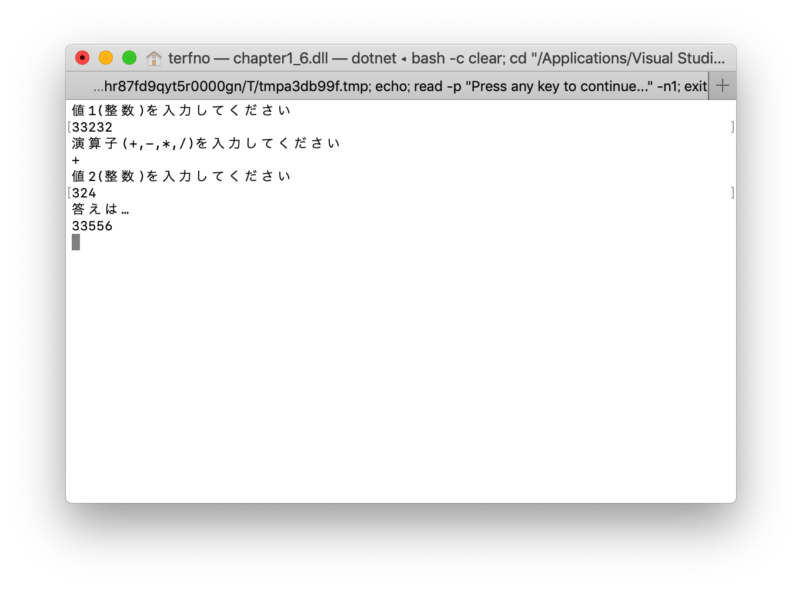
<div class="center">図1.6.1 制作した電卓</div>

### 問題1.7
> 実験書の図1.17のプログラムをさくせいし、ソースコードと実行結果のスクリーンショットを報告しなさい。

ソースコードを図1.7に示す。
```cs
using System;

namespace chapter1_7
{
    class Program
    {
        static void Main(string[] args)
        {
            for(int j = 0; j < 5; j++)
            {
                for(int i = 0; i <= j; i++)
                {
                    Console.Write("*");
                }
                Console.WriteLine();
            }
        }
    }
}

```
<div class="center">図1.7 2重ループ</div><br>

実行結果を図1.7.1に示す。
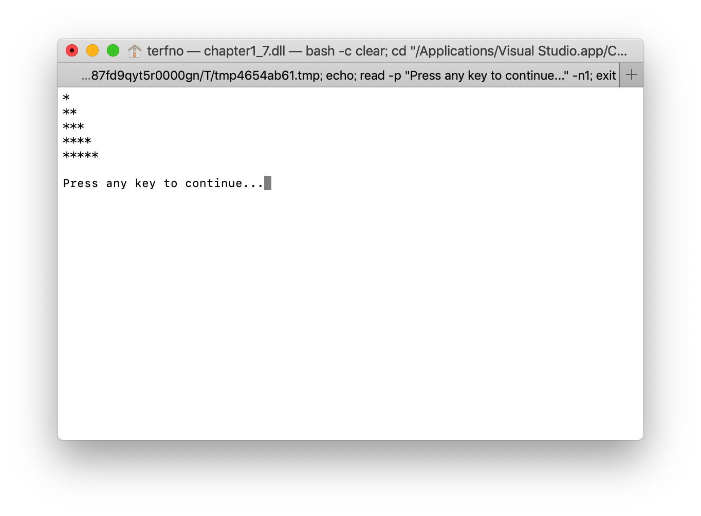
<div class="center">図1.7.1 2重ループの実行結果</div>

### 問題1.8
>実験書の図1.18のプログラムを作成し、ソースコードと実行結果のスクリーンショットを報告しなさい。

ソースコードを図1.8に示す。
```cs
using System;

namespace chapter1_8
{
    class Program
    {
        static void Main(string[] args)
        {
            double[] dlist = new double[] { 3.14, 1592, 6534 };

            foreach(double d in dlist)
            {
                Console.WriteLine(d);
            }
        }
    }
}

```
<div class="center">図1.8 foreachによる繰り返し</div><br>

実行結果を図1.8.1に示す。
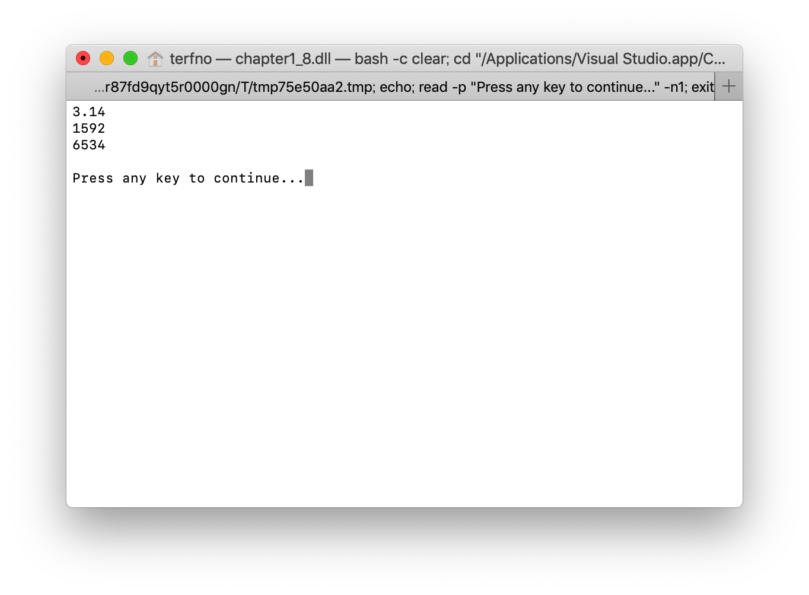
<div class="center">図1.8.1 foreachの実行結果</div>

### 問題1.9
>問題1.6を拡張し、eと入力するまでプログラムを実行し続けるように改変し、ソースコードと実行結果のスクリーンショットを報告しなさい。

ソースコードを図1.9に示す。
```cs
using System;

namespace chapter1_9
{
    class Program
    {
        static void Main(string[] args)
        {
            Console.WriteLine("値1(整数)を入力してください");
            string value1 = Console.ReadLine();
            if (value1 == "e")
            {
                Environment.Exit(0);

            }
            int v1 = int.Parse(value1);

            Console.WriteLine("演算子(+,-,*,/)を入力してください");
            string cal = Console.ReadLine();
            if (value1 == "e")
            {
                Environment.Exit(0);
            }

            Console.WriteLine("値2(整数)を入力してください");
            string value2 = Console.ReadLine();
            if (value1 == "e")
            {
                Environment.Exit(0);
            }
            int v2 = int.Parse(value2);

            Console.WriteLine("答えは…");

            for(; ; )
            {
                switch (cal)
                {
                    case "+":
                        Console.WriteLine(v1 + v2);
                        break;
                    case "-":
                        Console.WriteLine(v1 - v2);
                        break;
                    case "*":
                        Console.WriteLine(v1 * v2);
                        break;
                    case "/":
                        Console.WriteLine(v1 / v2);
                        break;
                    default:
                        Console.WriteLine("error");
                        break;
                }
                Console.WriteLine("値1(整数)を入力してください");
                value1 = Console.ReadLine();
                if (value1 == "e")
                {
                    Environment.Exit(0);
                }
                v1 = int.Parse(value1);

                Console.WriteLine("演算子(+,-,*,/)を入力してください");
                cal = Console.ReadLine();
                if (value1 == "e")
                {
                    Environment.Exit(0);
                }

                Console.WriteLine("値2(整数)を入力してください");
                value2 = Console.ReadLine();
                if (value1 == "e")
                {
                    Environment.Exit(0);
                }
                v2 = int.Parse(value2);

                Console.WriteLine("答えは…");

            }
        }
    }
}

```
<div class="center">図1.9 UXが若干向上した簡易計算機</div><br>

実行結果を図1.9.1に示す。
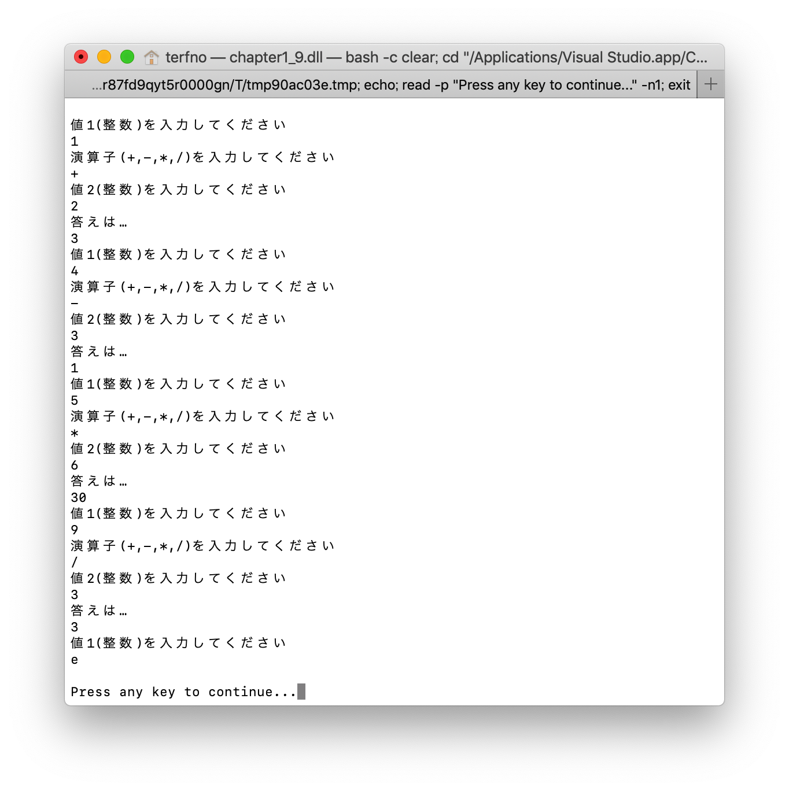
<div class="center">図1.9.1 簡易計算機の実行結果</div>

### 問題1.10
>実験書図1.19のプログラムを作成、実行、エラー解消し、それぞれを報告しなさい。

エラー時のスクリーンショットを図1.10.1に示す。
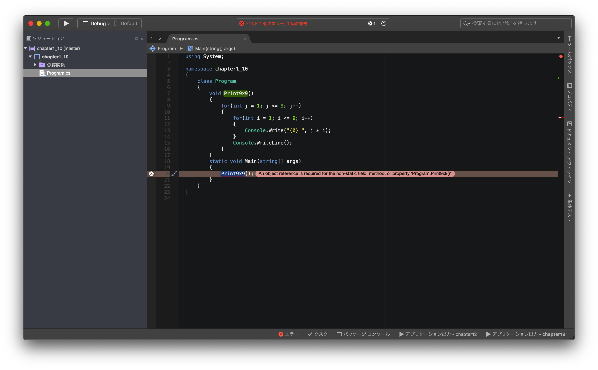
<div class="center">図1.10.1 エラー</div>

エラー解消後のスクリーンショットを図1.10.2に示す。
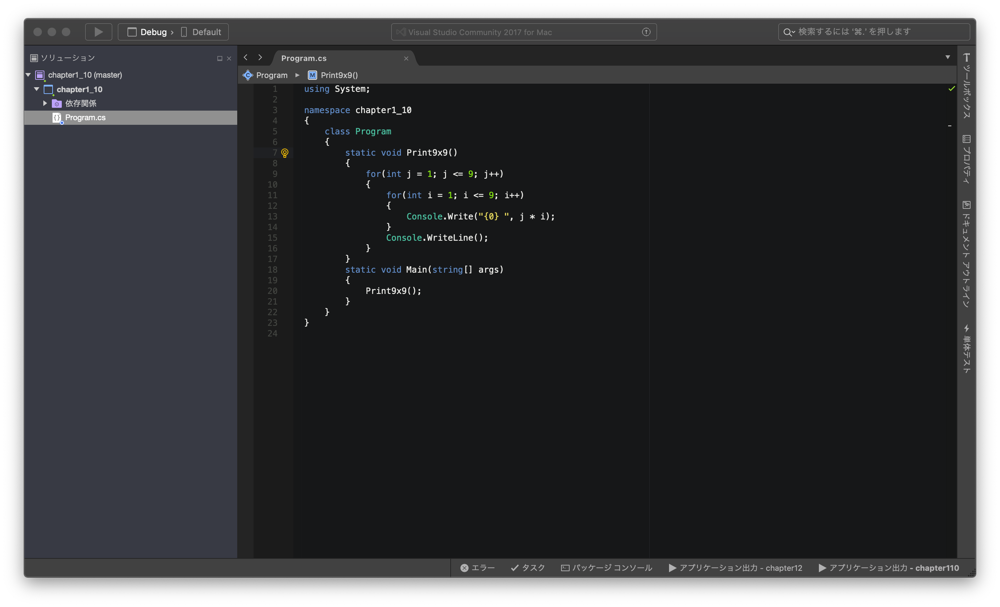
<div class="center">図1.10.2 エラー解消</div>

また、ソースコードを図1.10.3に示す。
```cs
using System;

namespace chapter1_10
{
    class Program
    {
        static void Print9x9()
        {
            for(int j = 1; j <= 9; j++)
            {
                for(int i = 1; i <= 9; i++)
                {
                    Console.Write("{0} ", j * i);
                }
                Console.WriteLine();
            }
        }
        static void Main(string[] args)
        {
            Print9x9();
        }
    }
}

```
<div class="center">図1.10.3 エラー解消後</div><br>

実行結果を図1.10.1に示す。
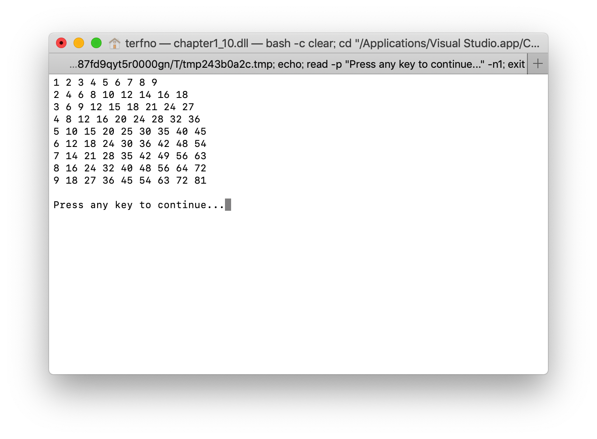
<div class="center">図1.10.1 9x9の実行結果</div>

### 問題1.11
>実験書の図1.21および、図1.22のソースコードと実行結果のスクリーンショットを報告しなさい。

`Program.cs`を図1.11.1に示す。
```cs
using System;

namespace chapter1_10
{
    class Program
    {
        static void Print9x9()
        {
            for(int j = 1; j <= 9; j++)
            {
                for(int i = 1; i <= 9; i++)
                {
                    Console.Write("{0} ", j * i);
                }
                Console.WriteLine();
            }
        }
        static void Main(string[] args)
        {
            Print9x9();
        }
    }
}

```
<div class="center">図1.11.1 Program.cs</div><br>

`TestNamespace.cs`を図1.11.2に示す。
```cs
using System;
namespace Hello
{
    public class TestNamespace
    {
        public static void PrintTest()
        {
            Console.WriteLine("Test Namespace!");
        }
    }
}

```
<div class="center">図1.11.2 TestNamespace.cs</div><br>

実行結果を図1.11.3に示す。
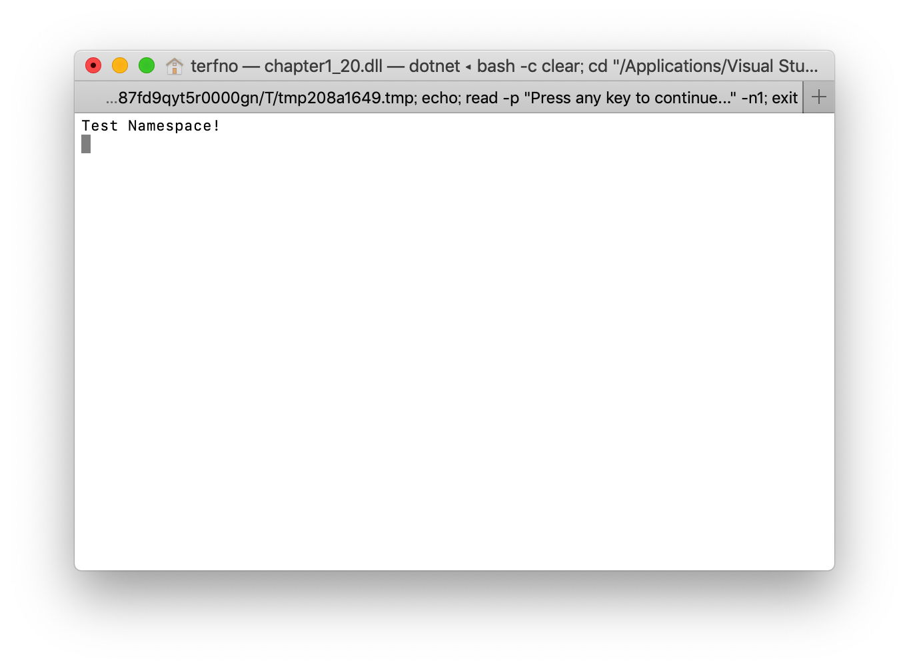
<div class="center">図1.11.3 実行結果</div>

## 課題
### 課題1.1
>セグメンテーション違反とはどういうエラーか、調べて報告しなさい。

グメンテーション違反はアクセスが許可されていないメモリ上の位置、もしくは許可されていない方法でメモリ上の位置にアクセスしようとするときに起こるエラーである。[^1]
[^1]:[セグメンテーション違反](https://ja.wikipedia.org/wiki/セグメンテーション違反)

### 課題1.2
>代表的な静的型付けプログラミング言語および動的型付け言語を調べて3つずつ報告しなさい。

静的型付けプログラミング言語の例
* Go Lang
* Haskell
* Swift

動的型付けプログラミング言語の例
* Lisp
* Ruby
* Python
