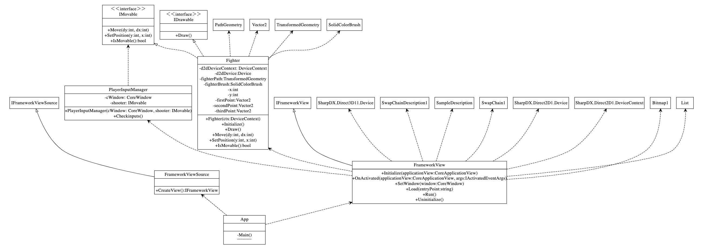
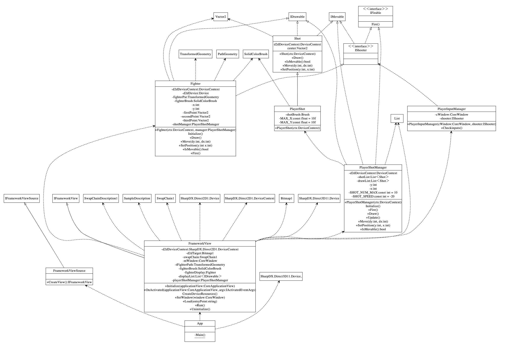

# 2019/07/12 プログラミング演習
<style>
    .c{
        text-align:center;
    }
</style>

## 目的
この演習においてはオブジェクト指向プログラミングの理解を深める。

## 装置/ツール
* Visual Studio
* Windows 10 Pro

## 実験
### 問題10.1
> 先週のプログラムを改変し、オブジェクト指向プログラムとして実験書の図10.1から図10.5までクラスの新規追加および既存クラスの改変をしなさい。
> ソースコードと実行結果を示しなさい。

ソースコードのPlayerInputManager.csを図10.1.1に示す。
```cs
using Windows.System;
using Windows.UI.Core;
using System;
using System.Collections.Generic;
using System.Linq;
using System.Text;
using System.Threading.Tasks;

namespace Shooting
{
	public class PlayerInputManager
	{
		private CoreWindow cWindow;
		private IMovable shooter;

		public PlayerInputManager(CoreWindow cWindow, IMovable shooter)
		{
			this.cWindow = cWindow;
			this.shooter = shooter;
		}

		public void Checkinputs()
		{
			var dx = 0;
			var dy = 0;

			if (this.cWindow.GetAsyncKeyState(VirtualKey.Right) == CoreVirtualKeyStates.Down)
			{
				dx += 10;
			}
			if (this.cWindow.GetAsyncKeyState(VirtualKey.Left) == CoreVirtualKeyStates.Down)
			{
				dx -= 10;
			}
			if (this.cWindow.GetAsyncKeyState(VirtualKey.Down) == CoreVirtualKeyStates.Down)
			{
				dy += 10;
			}
			if (this.cWindow.GetAsyncKeyState(VirtualKey.Up) == CoreVirtualKeyStates.Down)
			{
				dy -= 10;
			}

			this.shooter.Move(dy, dx);
		}
	}
}

```
<div class="c">図10.1.1 PlayerInputManager.cs</div>

ソースコードのFighter.csのソースコードを図10.1.2に示す。
```cs
using System;
using System.Collections.Generic;
using System.Linq;
using System.Text;
using System.Threading.Tasks;
using SharpDX;
using SharpDX.Direct2D1;

namespace Shooting
{
	public class Fighter : IDrawable, IMovable
	{
		private DeviceContext d2dDeviceContext;
		private Device d2dDevice;
		private TransformedGeometry fighterPath;
		private SolidColorBrush fighterBrush;

		private int x;
		private int y;
		private Vector2 firstPoint;
		private Vector2 secondPoint;
		private Vector2 thirdPoint;

		public Fighter(DeviceContext ctx)
		{
			this.d2dDeviceContext = ctx;
			this.d2dDevice = ctx.Device;

			this.Initialize();
		}

		private void Initialize()
		{
			this.x = 0;
			this.y = 0;

			var path = new PathGeometry(this.d2dDevice.Factory);

			this.firstPoint = new Vector2(25f, 0f);
			this.secondPoint = new Vector2(50f, 50f);
			this.thirdPoint = new Vector2(0f, 50f);

			var sink = path.Open();

			sink.BeginFigure(this.firstPoint, FigureBegin.Filled);

			sink.AddLines(new SharpDX.Mathematics.Interop.RawVector2[]
			{
				this.secondPoint,
				this.thirdPoint
			});

			sink.EndFigure(FigureEnd.Closed);
			sink.Close();

			this.fighterPath = new TransformedGeometry(this.d2dDevice.Factory, path, Matrix3x2.Identity);

			this.fighterBrush = new SolidColorBrush(this.d2dDeviceContext, Color.OrangeRed);
		}

		public void Draw()
		{
			var fTransform = this.fighterPath.Transform;
			fTransform.M31 = this.x;
			fTransform.M32 = this.y;

			this.d2dDeviceContext.Transform = fTransform;
			this.d2dDeviceContext.DrawGeometry(this.fighterPath, this.fighterBrush);
			this.d2dDeviceContext.Transform = this.fighterPath.Transform;
		}

		public void Move(int dy, int dx)
		{
			this.x += dx;
			this.y += dy;

			//this.shotManager.Move(dy, dx);
		}

		public void SetPosition(int y, int x)
		{
			this.y = y - 25;
			this.x = x - 25;

			//this.shotManager.SetPosition(this.y, this.x);
		}

		public bool IsMovable()
		{
			if (this.y >= 0 && this.x >= 0)
			{
				return true;
			}
			else
			{
				return false;
			}
		}

	}
}

```
<div class="c">図10.1.2 Fighter.cs</div>

ソースコードのIMovable.csを図10.1.3に示す。
```cs
using System;
using System.Collections.Generic;
using System.Linq;
using System.Text;
using System.Threading.Tasks;

namespace Shooting
{
	public interface IMovable
	{
		void Move(int dy, int dx);
		void SetPosition(int y, int x);
		bool IsMovable();
	}
}

```
<div class="c">図10.1.3 IMovable.cs</div>

ソースコードのIDrawable.csを図10.1.4に示す。
```cs
using System;
using System.Collections.Generic;
using System.Linq;
using System.Text;
using System.Threading.Tasks;

namespace Shooting
{
	public interface IDrawable
	{
		void Draw();
	}
}

```
<div class="c">図10.1.4 IDrawable.cs</div>

ソースコードのApp.csを図10.1.5に示す。
```cs
using SharpDX;
using SharpDX.Direct2D1;
using SharpDX.Direct3D;
using SharpDX.Direct3D11;
using SharpDX.DXGI;
using System;
using System.Diagnostics;
using Windows.ApplicationModel.Activation;
using Windows.ApplicationModel.Core;
using Windows.Graphics.Display;
using Windows.UI.Core;
using Windows.System;
using System.Collections.Generic;

namespace Shooting
{
	class App
	{
		[MTAThread]
		private static void Main()
		{
			var viewFactory = new FrameworkViewSource();

			CoreApplication.Run(viewFactory);
		}

		class FrameworkViewSource : IFrameworkViewSource
		{
			public IFrameworkView CreateView()
			{
				return new FrameworkView();
			}
		}

		class FrameworkView : IFrameworkView
		{
			private SharpDX.Direct2D1.DeviceContext d2dDeviceContext;
			private Bitmap1 d2dTarget;
			private SwapChain1 swapChain;
			private CoreWindow mWindow;

			// 9.6追記
			private TransformedGeometry tFighterPath;
			private SolidColorBrush fighterBrush;

			//10.5追記
			private Fighter fighterDisplay;
			private List<IDrawable> displayList;

			public void Initialize(CoreApplicationView applicationView)
			{
				Debug.WriteLine("Initialize");

				applicationView.Activated += OnActivated;
			}

			void OnActivated(CoreApplicationView applicationView, IActivatedEventArgs args)
			{
				CoreWindow.GetForCurrentThread().Activate();
			}

			void CreateDeviceResources()
			{
				var defaultDevice = new SharpDX.Direct3D11.Device(DriverType.Hardware, DeviceCreationFlags.Debug | DeviceCreationFlags.BgraSupport);

				var device = defaultDevice.QueryInterface<SharpDX.Direct3D11.Device1>();

				var dxgiDevice2 = device.QueryInterface<SharpDX.DXGI.Device2>();

				var dxgiAdapter = dxgiDevice2.Adapter;
				SharpDX.DXGI.Factory2 dxgiFactory2 = dxgiAdapter.GetParent<SharpDX.DXGI.Factory2>();

				var desc = new SwapChainDescription1();
				desc.Width = 480;
				desc.Height = 640;
				desc.Format = Format.B8G8R8A8_UNorm;
				desc.Stereo = false;
				desc.SampleDescription = new SampleDescription(1, 0);
				desc.Usage = Usage.RenderTargetOutput;
				desc.BufferCount = 2;
				desc.Scaling = Scaling.AspectRatioStretch;
				desc.SwapEffect = SwapEffect.FlipSequential;
				desc.Flags = SwapChainFlags.AllowModeSwitch;

				this.swapChain = new SwapChain1(dxgiFactory2, device, new ComObject(mWindow), ref desc);

				var d2dDevice = new SharpDX.Direct2D1.Device(dxgiDevice2);

				this.d2dDeviceContext = new SharpDX.Direct2D1.DeviceContext(d2dDevice, DeviceContextOptions.None);

				var backBuffer = this.swapChain.GetBackBuffer<Surface>(0);

				var displayInfo = DisplayInformation.GetForCurrentView();

				this.d2dTarget = new Bitmap1(this.d2dDeviceContext, backBuffer, new BitmapProperties1(new PixelFormat(Format.B8G8R8A8_UNorm, SharpDX.Direct2D1.AlphaMode.Premultiplied), displayInfo.LogicalDpi, displayInfo.LogicalDpi, BitmapOptions.Target | BitmapOptions.CannotDraw));

				// 10.5改変
				this.fighterDisplay = new Fighter(this.d2dDeviceContext);
				this.fighterDisplay.SetPosition(540, 240);

				this.displayList = new List<IDrawable>();
				this.displayList.Add(this.fighterDisplay);
			}

			public void SetWindow(CoreWindow window)
			{
				Debug.WriteLine("SetWndow: " + window);

				this.mWindow = window;
			}

			public void Load(string entryPoint)
			{
				Debug.WriteLine("Load: " + entryPoint);

				this.CreateDeviceResources();
			}

			public void Run()
			{
				Debug.WriteLine("Run");

				// 10.5追記
				var playerInputManager = new PlayerInputManager(this.mWindow, this.fighterDisplay);

				while (true)
				{
					this.mWindow.Dispatcher.ProcessEvents(CoreProcessEventsOption.ProcessAllIfPresent);

					// 入力
					if(this.mWindow.GetAsyncKeyState(VirtualKey.Escape) == CoreVirtualKeyStates.Down)
					{
						return;
					}

					playerInputManager.Checkinputs();
					
					// 出力
					this.d2dDeviceContext.Target = d2dTarget;
					this.d2dDeviceContext.BeginDraw();
					this.d2dDeviceContext.Clear(Color.CornflowerBlue);

					// 描画
					// 10.5　追記
					foreach(var d in this.displayList)
					{
						d.Draw();
					}

					this.d2dDeviceContext.EndDraw();

					this.swapChain.Present(0, PresentFlags.None);
					//待機　未実装
				}
			}

			public void Uninitialize()
			{
				Debug.WriteLine("Uninitialize");

				this.swapChain.Dispose();
				this.d2dDeviceContext.Dispose();
				this.d2dTarget.Dispose();
			}
		}
	}
}

```
<div class="c">図10.1.5 App.cs</div>

実行結果を図10.1.6に示す。

<div class="c">図10.1.6 実行結果</div>

### 問題10.2
> 本節のプログラムの追加および変更箇所を反映し、時期から玉を発射する機能をプログラムに追加しなさい。またそのソースコードおよび、実行結果をスクリーンショットで示しなさい。

ソースコードのApp.csを図10.2.1に示す。
``` cs
using SharpDX;
using SharpDX.Direct2D1;
using SharpDX.Direct3D;
using SharpDX.Direct3D11;
using SharpDX.DXGI;
using System;
using System.Diagnostics;
using Windows.ApplicationModel.Activation;
using Windows.ApplicationModel.Core;
using Windows.Graphics.Display;
using Windows.UI.Core;
using Windows.System;
using System.Collections.Generic;

namespace Shooting
{
	class App
	{
		[MTAThread]
		private static void Main()
		{
			var viewFactory = new FrameworkViewSource();

			CoreApplication.Run(viewFactory);
		}

		class FrameworkViewSource : IFrameworkViewSource
		{
			public IFrameworkView CreateView()
			{
				return new FrameworkView();
			}
		}

		class FrameworkView : IFrameworkView
		{
			private SharpDX.Direct2D1.DeviceContext d2dDeviceContext;
			private Bitmap1 d2dTarget;
			private SwapChain1 swapChain;
			private CoreWindow mWindow;

			// 9.6追記
			private TransformedGeometry tFighterPath;
			private SolidColorBrush fighterBrush;

			//10.5追記 自機作成
			private Fighter fighterDisplay;
			private List<IDrawable> displayList;

			//10.13追記
			private PlayerShotManager playerShotManager;

			public void Initialize(CoreApplicationView applicationView)
			{
				Debug.WriteLine("Initialize");

				applicationView.Activated += OnActivated;
			}

			void OnActivated(CoreApplicationView applicationView, IActivatedEventArgs args)
			{
				CoreWindow.GetForCurrentThread().Activate();
			}

			void CreateDeviceResources()
			{
				var defaultDevice = new SharpDX.Direct3D11.Device(DriverType.Hardware, DeviceCreationFlags.Debug | DeviceCreationFlags.BgraSupport);

				var device = defaultDevice.QueryInterface<SharpDX.Direct3D11.Device1>();

				var dxgiDevice2 = device.QueryInterface<SharpDX.DXGI.Device2>();

				var dxgiAdapter = dxgiDevice2.Adapter;
				SharpDX.DXGI.Factory2 dxgiFactory2 = dxgiAdapter.GetParent<SharpDX.DXGI.Factory2>();

				var desc = new SwapChainDescription1();
				desc.Width = 480;
				desc.Height = 640;
				desc.Format = Format.B8G8R8A8_UNorm;
				desc.Stereo = false;
				desc.SampleDescription = new SampleDescription(1, 0);
				desc.Usage = Usage.RenderTargetOutput;
				desc.BufferCount = 2;
				desc.Scaling = Scaling.AspectRatioStretch;
				desc.SwapEffect = SwapEffect.FlipSequential;
				desc.Flags = SwapChainFlags.AllowModeSwitch;

				this.swapChain = new SwapChain1(dxgiFactory2, device, new ComObject(mWindow), ref desc);

				var d2dDevice = new SharpDX.Direct2D1.Device(dxgiDevice2);

				this.d2dDeviceContext = new SharpDX.Direct2D1.DeviceContext(d2dDevice, DeviceContextOptions.None);

				var backBuffer = this.swapChain.GetBackBuffer<Surface>(0);

				var displayInfo = DisplayInformation.GetForCurrentView();

				this.d2dTarget = new Bitmap1(this.d2dDeviceContext, backBuffer, new BitmapProperties1(new PixelFormat(Format.B8G8R8A8_UNorm, SharpDX.Direct2D1.AlphaMode.Premultiplied), displayInfo.LogicalDpi, displayInfo.LogicalDpi, BitmapOptions.Target | BitmapOptions.CannotDraw));

				// 10.5改変
				this.playerShotManager = new PlayerShotManager(this.d2dDeviceContext);

				this.fighterDisplay = new Fighter(this.d2dDeviceContext, playerShotManager);
				this.fighterDisplay.SetPosition(540, 240);

				this.displayList = new List<IDrawable>();
				this.displayList.Add(this.fighterDisplay);
				this.displayList.Add(this.playerShotManager);
			}

			public void SetWindow(CoreWindow window)
			{
				Debug.WriteLine("SetWndow: " + window);

				this.mWindow = window;
			}

			public void Load(string entryPoint)
			{
				Debug.WriteLine("Load: " + entryPoint);

				this.CreateDeviceResources();
			}

			public void Run()
			{
				Debug.WriteLine("Run");

				// 10.5追記
				var playerInputManager = new PlayerInputManager(this.mWindow, this.fighterDisplay);

				while (true)
				{
					this.mWindow.Dispatcher.ProcessEvents(CoreProcessEventsOption.ProcessAllIfPresent);

					// 入力
					if(this.mWindow.GetAsyncKeyState(VirtualKey.Escape) == CoreVirtualKeyStates.Down)
					{
						return;
					}

					playerInputManager.Checkinputs();
					playerShotManager.Update();
					
					// 出力
					this.d2dDeviceContext.Target = d2dTarget;
					this.d2dDeviceContext.BeginDraw();
					this.d2dDeviceContext.Clear(Color.CornflowerBlue);

					// 描画
					// 10.5　追記
					foreach(var d in this.displayList)
					{
						d.Draw();
					}

					this.d2dDeviceContext.EndDraw();

					this.swapChain.Present(0, PresentFlags.None);
					//待機　未実装
				}
			}

			public void Uninitialize()
			{
				Debug.WriteLine("Uninitialize");

				this.swapChain.Dispose();
				this.d2dDeviceContext.Dispose();
				this.d2dTarget.Dispose();
			}
		}
	}
}

```
<div class="c">図10.2.1 App.cs</div>

ソースコードのFighter.csを図10.2.2に示す。
```cs
using System;
using System.Collections.Generic;
using System.Linq;
using System.Text;
using System.Threading.Tasks;
using SharpDX;
using SharpDX.Direct2D1;

namespace Shooting
{
	public class Fighter : IDrawable, IShooter
	{
		private DeviceContext d2dDeviceContext;
		private Device d2dDevice;
		private TransformedGeometry fighterPath;
		private SolidColorBrush fighterBrush;

		private int x;
		private int y;
		private Vector2 firstPoint;
		private Vector2 secondPoint;
		private Vector2 thirdPoint;

		// 10.11追記
		private PlayerShotManager shotManager;

		public Fighter(DeviceContext ctx, PlayerShotManager manager)
		{
			this.d2dDeviceContext = ctx;
			this.d2dDevice = ctx.Device;

			// 10.11追記
			this.shotManager = manager;

			this.Initialize();
		}

		private void Initialize()
		{
			this.x = 0;
			this.y = 0;

			var path = new PathGeometry(this.d2dDevice.Factory);

			this.firstPoint = new Vector2(25f, 0f);
			this.secondPoint = new Vector2(50f, 50f);
			this.thirdPoint = new Vector2(0f, 50f);

			var sink = path.Open();

			sink.BeginFigure(this.firstPoint, FigureBegin.Filled);

			sink.AddLines(new SharpDX.Mathematics.Interop.RawVector2[]
			{
				this.secondPoint,
				this.thirdPoint
			});

			sink.EndFigure(FigureEnd.Closed);
			sink.Close();

			this.fighterPath = new TransformedGeometry(this.d2dDevice.Factory, path, Matrix3x2.Identity);

			this.fighterBrush = new SolidColorBrush(this.d2dDeviceContext, Color.OrangeRed);
		}

		public void Draw()
		{
			var fTransform = this.fighterPath.Transform;
			fTransform.M31 = this.x;
			fTransform.M32 = this.y;

			this.d2dDeviceContext.Transform = fTransform;
			this.d2dDeviceContext.DrawGeometry(this.fighterPath, this.fighterBrush);
			this.d2dDeviceContext.Transform = this.fighterPath.Transform;
		}

		public void Move(int dy, int dx)
		{
			this.x += dx;
			this.y += dy;

			this.shotManager.Move(dy, dx);
		}

		public void SetPosition(int y, int x)
		{
			this.y = y - 25;
			this.x = x - 25;

			this.shotManager.SetPosition(this.y, this.x);
		}

		public bool IsMovable()
		{
			if (this.y >= 0 && this.x >= 0)
			{
				return true;
			}
			else
			{
				return false;
			}
		}

		public void Fire()
		{
			this.shotManager.Fire();
		}

	}
}

```
<div class="c">図10.2.2 Fighter.cs</div>

ソースコードのPlayerInputManager.csを図10.2.3に示す。
```cs
using Windows.System;
using Windows.UI.Core;
using System;
using System.Collections.Generic;
using System.Linq;
using System.Text;
using System.Threading.Tasks;

namespace Shooting
{
	public class PlayerInputManager
	{
		private CoreWindow cWindow;
		// 10.11改変
		private IShooter shooter;

		public PlayerInputManager(CoreWindow cWindow, IShooter shooter)
		{
			this.cWindow = cWindow;
			this.shooter = shooter; //　改変
		}

		public void Checkinputs()
		{
			var dx = 0;
			var dy = 0;

			if (this.cWindow.GetAsyncKeyState(VirtualKey.Right) == CoreVirtualKeyStates.Down)
			{
				dx += 10;
			}
			if (this.cWindow.GetAsyncKeyState(VirtualKey.Left) == CoreVirtualKeyStates.Down)
			{
				dx -= 10;
			}
			if (this.cWindow.GetAsyncKeyState(VirtualKey.Down) == CoreVirtualKeyStates.Down)
			{
				dy += 10;
			}
			if (this.cWindow.GetAsyncKeyState(VirtualKey.Up) == CoreVirtualKeyStates.Down)
			{
				dy -= 10;
			}
			if (this.cWindow.GetAsyncKeyState(VirtualKey.Space) == CoreVirtualKeyStates.Down)
			{
				this.shooter.Fire();
			}

			this.shooter.Move(dy, dx);
		}
	}
}

```
<div class="c">図10.2.3 PlayerInputManager.cs</div>

ソースコードのIFirable.csを図10.2.4に示す。
```cs
using System;
using System.Collections.Generic;
using System.Linq;
using System.Text;
using System.Threading.Tasks;

namespace Shooting
{
	public interface IFirable
	{
		void Fire();
	}
}

```
<div class="c">図10.2.4 IFirable.cs</div>

ソースコードのIShooter.csを図10.2.5に示す。
```cs
using System;
using System.Collections.Generic;
using System.Linq;
using System.Text;
using System.Threading.Tasks;

namespace Shooting
{
	public interface IShooter: IMovable, IFirable
	{

	}
}

```
<div class="c">図10.2.5 IShooter.cs</div>

ソースコードのPlayerShot.csを図10.2.6に示す。
```cs
using SharpDX;
using SharpDX.Direct2D1;
using System;
using System.Collections.Generic;
using System.Linq;
using System.Text;
using System.Threading.Tasks;

namespace Shooting
{
	public class PlayerShot : Shot
	{
		private Brush shotBrush;
		private const float MAX_X = 10f;
		private const float MAX_Y = 10f;

		public PlayerShot(DeviceContext ctx) : base(ctx)
		{
			this.shotBrush = new SolidColorBrush(this.d2dDeviceContext, Color.Red);
		}

		public override void Draw()
		{
			this.d2dDeviceContext.FillEllipse(new Ellipse(this.center, MAX_X, MAX_Y), this.shotBrush);
		}

		public override void SetPosition(int y, int x)
		{
			this.center.Y = y + 25f;
			this.center.X = x + 25f;
		}
	}
}

```
<div class="c">図10.2.6 PlayerShot.cs</div>

ソースコードのshot.csを図10.2.7に示す。
```cs
using SharpDX;
using SharpDX.Direct2D1;
using System;
using System.Collections.Generic;
using System.Linq;
using System.Text;
using System.Threading.Tasks;

namespace Shooting
{
	public abstract class Shot : IDrawable, IMovable
	{
		protected DeviceContext d2dDeviceContext;
		protected Vector2 center;

		public Shot(DeviceContext ctx)
		{
			this.d2dDeviceContext = ctx;
			this.center = new Vector2();
		}

		public abstract void Draw();

		public bool IsMovable()
		{
			if (this.center.X >= 0 && this.center.Y >= 0)
			{
				return true;
			}
			else
			{
				return false;
			}
		}

		public void Move(int dy, int dx)
		{
			this.center.X = this.center.X + dx;
			this.center.Y = this.center.Y + dy;
		}

		public abstract void SetPosition(int y, int x);
	}
}

```
<div class="c">図10.2.7 Shot.cs</div>

ソースコードのPlayerShotManager.csを図10.2.8に示す。
```cs
using System;
using System.Collections.Generic;
using System.Linq;
using System.Text;
using System.Threading.Tasks;
using SharpDX.Direct2D1;
using System.Collections.Generic;

namespace Shooting
{
	public class PlayerShotManager : IDrawable, IMovable, IFirable
	{
		private DeviceContext d2dDeviceContext;
		private List<Shot> shotList;
		private List<Shot> drawList;
		private int y;
		private int x;
		private const int SHOT_NUM_MAX = 10;
		private const int SHOT_SPEED = -20;

		public PlayerShotManager(DeviceContext ctx)
		{
			this.d2dDeviceContext = ctx;
			this.Initialize();
		}

		private void Initialize()
		{
			this.y = 0;
			this.x = 0;

			this.shotList = new List<Shot>();

			for(int i =0;i < SHOT_NUM_MAX; i++)
			{
				this.shotList.Add(new PlayerShot(this.d2dDeviceContext));
			}
			this.drawList = new List<Shot>();
		}

		public void Fire()
		{
			if(this.drawList.Count < SHOT_NUM_MAX)
			{
				var shot = this.shotList[0];
				shot.SetPosition(this.y, this.x);
				this.drawList.Add(shot);
				this.shotList.RemoveAt(0);
			}
		}

		public void Draw()
		{
			for(int i = 0; i < this.drawList.Count; i++)
			{
				this.drawList[i].Draw();
			}
		}

		public void Update()
		{
			for(int i = 0; i < this.drawList.Count; i++)
			{
				var shot = this.drawList[i];

				if (shot.IsMovable())
				{
					shot.Move(SHOT_SPEED, 0);
				}
				else
				{
					this.shotList.Add(shot);
					this.drawList.RemoveAt(i);
				}
			}
		}

		public void Move(int dy, int dx)
		{
			this.y += dy;
			this.x += dx;
		}

		public void SetPosition(int y, int x)
		{
			this.y = y;
			this.x = x;
		}

		public bool IsMovable()
		{
			if(this.y>=0 && this.x >= 0)
			{
				return true;
			}
			else
			{
				return false;
			}
		}
	}
}

```
<div class="c">図10.2.7 Shot.cs</div>

実行結果を図10.2.8に示す。

<div class="c">図10.2.8 実行結果</div>

## 課題
### レポート課題10.1
> 問題10.1段階でのクラス図を描きなさい。

<!-- ```graphviz
digraph obj{
	node[shape=record];
	rankdir="BT";
	
	PlayerInputManager [label="{
    PlayerInputManager |
    -cWindow: CoreWindow \n
    -shooter: IMovable |
    +PlayerInputManager(cWindow: CoreWindow, shooter: IMovable) \n
    +Checkinputs()
    }"]
    
    Fighter [label="{
    Fighter |
    -d2dDeviceContext: DeviceContext \n
    -d2dDevice:Device \n
    -fighterPath:TransformedGeometry \n
    -fighterBrush:SolidColorBrush \n
    -x:int \n
    -y:int \n
    -firstPoint:Vector2 \n
    -secondPoint:Vector2 \n
    -thirdPoint:Vector2 |
    +Fighter(ctx:DeviceContext) \n
    +Initialize() \n
    +Draw() \n
    +Move(dy:int, dx:int) \n
    +SetPosition(y:int, x:int) \n
    +IsMovable():bool
    }"]
    
    IMovable[label="{
    ＜＜interface＞＞\n
    IMovable ||
    +Move(dy:int, dx:int) \n
    +SetPosition(y:int, x:int) \n
    +IsMovable():bool
    }"]
    
    IDrawable[label="{
    ＜＜interface＞＞\n
    IDrawable ||
    +Draw()
    }"]
    
    App [label="{
    App||
    -Main()\n
    ¯¯¯¯¯¯¯¯¯
    }"]

    FrameworkViewSource [label="{
    FrameworkViewSource||
    +CreateView():IFrameworkView
    }"]
    
    FrameworkView [label="{
    FrameworkView|
    -d2dDeviceContext:SharpDX.Direct2D1.DeviceContext \n
    -d2dTarget:Bitmap1 \n
    -swapChain:SwapChain1 \n
    -mWindow:CoreWindow \n
    -tFighterPath:TransformedGeometry \n
    -fighterBrush:SolidColorBrush \n
    -fighterDisplay:Fighter \n
    -displayList:List<IDrawable> |
    +Initialize(applicationView:CoreApplicationView) \n
    +OnActivated(applicationView:CoreApplicationView, args:IActivatedEventArgs) \n
    +SetWindow(window:CoreWindow) \n
    +Load(entryPoint:string) \n
    +Run() \n
    +Uninitialize()
    }"]
    
    // クラス継承
	edge [arrowhead = "empty"]
    FrameworkViewSource -> IFrameworkViewSource
    FrameworkView -> IFrameworkView
	
    // インターフェース
	edge [arrowhead = "empty" style="dashed"]
	Fighter -> IDrawable
    Fighter -> IMovable
    
    // 依存
	edge [arrowhead = "vee" style="dashed"]
	PlayerInputManager -> IMovable
    Fighter -> PathGeometry,Vector2,TransformedGeometry,SolidColorBrush
    App -> FrameworkViewSource,FrameworkView
    FrameworkView -> "SharpDX.Direct3D11.Device",SwapChainDescription1,SampleDescription,SwapChain1,"SharpDX.Direct2D1.Device","SharpDX.Direct2D1.DeviceContext",Bitmap1,Fighter,List,PlayerInputManager
}
``` -->

クラス図を図10.3に示す。

<div class="c">図10.3 問題10.1段階でのクラス図</div>

### レポート課題10.2
> 本プログラムで使われているデザインパターンを挙げなさい。

MainがstaticなのでSingletonだると推測した。

### レポート課題10.3
> 今週改変した箇所で改良できそうな箇所を挙げ、具体的な改良方法を検討しなさい。

座標情報であるxとyの宣言や使用の順番がところどころで違うのでどちらかに統一したほうが可読性が高くなると考えた。

### レポート課題10.4
> 問題10.2段階でのクラス図を描きなさい。

<!-- ```graphviz
digraph obj{
    node[shape=record]
    rankdir="BT"
    
    App[label="{
    App||
    -Main()\n
    ¯¯¯¯¯¯¯¯¯
    }"]
    
    FrameworkViewSource[label="{
    FrameworkViewSource||
    +CreateView():IFrameworkView
    }"]
    
    FrameworkView [label="{
    FrameworkView |
    -d2dDeviceContext:SharpDX.Direct2D1.DeviceContext \n
    -d2dTarget:Bitmap1 \n
    -swapChain:SwapChain1 \n
    -mWindow:CoreWindow \n
    -tFighterPath:TransformedGeometry \n
    -fighterBrush:SolidColorBrush \n
    -fighterDisplay:Fighter \n 
    -displayList:List＜IDrawable＞ \n
    -playerShotManager:PlayerShotManager \n|
    +Initialize(applicationView:CoreApplicationView)\n
    +OnActivated(applicationView:CoreApplicationView, args:IActivatedEventArgs)\n
    CreateDeviceResources()\n
    +SetWindow(window:CoreWindow)\n
    +Load(entryPoint:string)\n
    +Run()\n
    +Uninitialize()
    }"]
    
    Fighter[label="{
    Fighter|
    -d2dDeviceContext:DeviceContext\n 
    -d2dDevice:Device \n
    -fighterPat:TransformedGeometry\n 
    -fighterBrush:SolidColorBrush \n
    -x:int \n
    -y:int \n
    -firstPoint:Vector2 \n
    -secondPoint:Vector2 \n
    -thirdPoint:Vector2 \n
    -shotManager:PlayerShotManager \n|
    +Fighter(ctx:DeviceContext, manager:PlayerShotManager)\n
    Initialize()\n
    +Draw()\n
    +Move(dy:int, dx:int)\n
    +SetPosition(y:int x:int)\n
    +IsMovable():bool\n
    +Fire()
    }"]
    
    PlayerInputManager[label="{
    PlayerInputManager|
    -cWindow:CoreWindow \n
    -shooter:IShooter \n|
    +PlayerInputManager(cWindow:CoreWindow, shooter:IShooter)\n
    +Checkinputs()\n
    }"]
    
    IFirable[label="{
    ＜＜interface＞＞\n
    IFirable||
    Fire()
    }"]
    
    IShooter[label="{
    ＜＜interface＞＞\n
    IShooter||
    }"]
    
    PlayerShot[label="{
    PlayerShot|
    -shotBrush:Brush \n
    -MAX_X:const float = 10f \n
    -MAX_Y:const float = 10f|
    +PlayerShot(ctx:DeviceContext)
    }"]
    
    Shot[label="{
    Shot|
    d2dDeviceContext:DeviceContext \n
    center:Vector2 |
    +Shot(ctx:DeviceContext)\n
    +Draw()\n
    +IsMovable():bool\n
    +Move(dy:int, dx:int)\n
    +SetPosition(y:int, x:int)
    }"]
    
    PlayerShotManager[label="{
    PlayerShotManager|
    -d2dDeviceContext:DeviceContext \n 
    -shotList:List＜Shot＞  \n
    -drawList:List＜Shot＞  \n
    -y:int  \n
    -x:int  \n
    -SHOT_NUM_MAX:const int = 10 \n
    -SHOT_SPEED:const int = -20 \n|
    +PlayerShotManager(ctx:DeviceContext)\n
    Initialize()\n
    +Fire()\n
    +Draw()\n
    +Update()\n
    +Move(dy:int, dx:int)\n
    +SetPosition(y:int, x:int)\n
    +IsMovable():bool
    }"]
    
    // クラス継承
	edge [arrowhead = "empty"]
    FrameworkViewSource -> IFrameworkViewSource
    FrameworkView -> IFrameworkView
    PlayerShot -> Shot
	
    // インターフェース
	edge [arrowhead = "empty" style="dashed"]
    Fighter -> IDrawable, IShooter
    IShooter -> IMovable, IFirable
    Shot -> IDrawable, IMovable
    PlayerShotManager -> IDrawable, IMovable, IFirable
    
    // 依存
	edge [arrowhead = "vee" style="dashed"]
    App -> FrameworkViewSource,FrameworkView,"SharpDX.Direct3D11.Device,"SwapChainDescription1,"SampleDescription","SwapChain1","SharpDX.Direct2D1.Device","SharpDX.Direct2D1.DeviceContext",Bitmap1,PlayerShotManager,Fighter,List,PlayerInputManager
    FrameworkView -> "SharpDX.Direct3D11.Device",SwapChainDescription1,SampleDescription,SwapChain1,"SharpDX.Direct2D1.Device","SharpDX.Direct2D1.DeviceContext",Bitmap1,PlayerShotManager,Fighter,List,PlayerInputManager
    Fighter -> PathGeometry,Vector2,TransformedGeometry,SolidColorBrush
    PlayerInputManager -> IShooter
    PlayerShot -> SolidColorBrush
    Shot -> Vector2
    PlayerShotManager -> List,PlayerShot
}
``` -->
クラス図を図10.4に示す。

<div class="c">図10.4 問題10.2段階でのクラス図</div>
