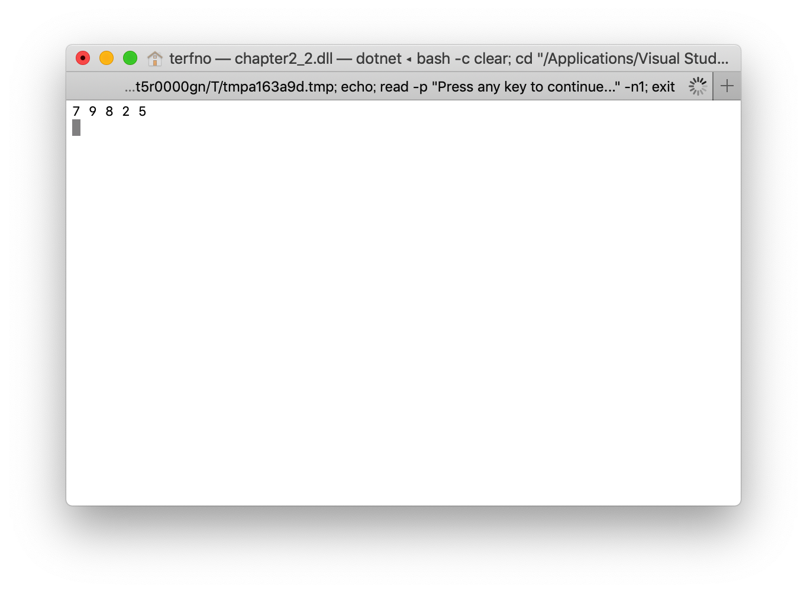
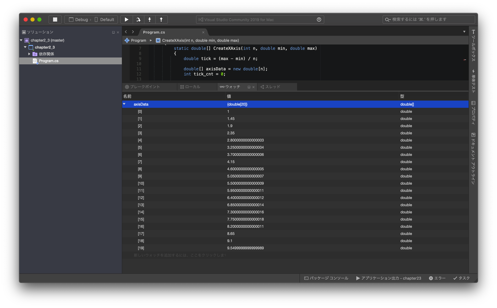
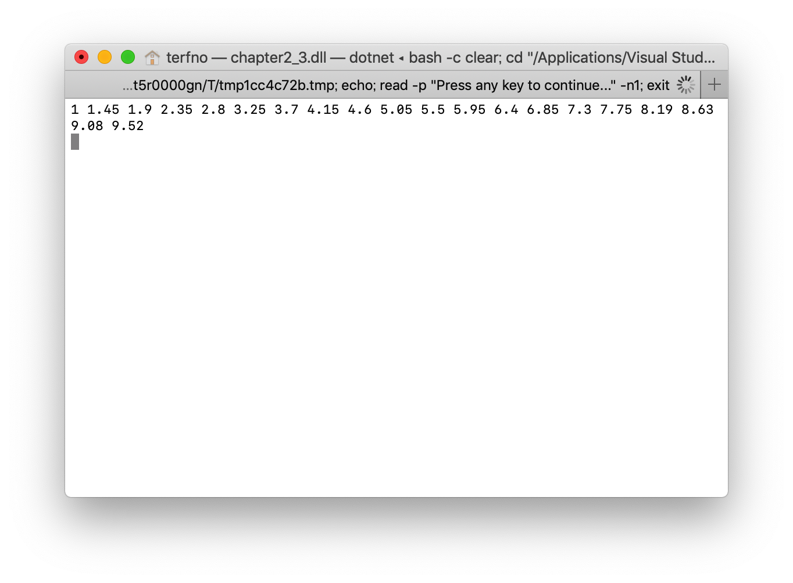
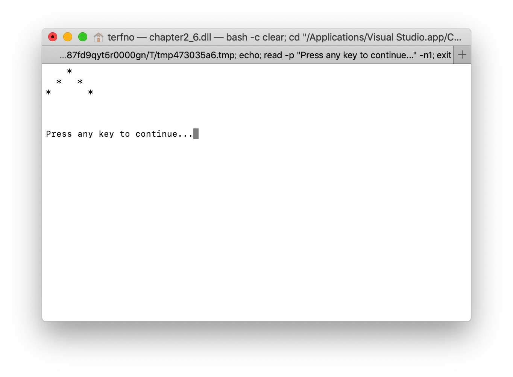
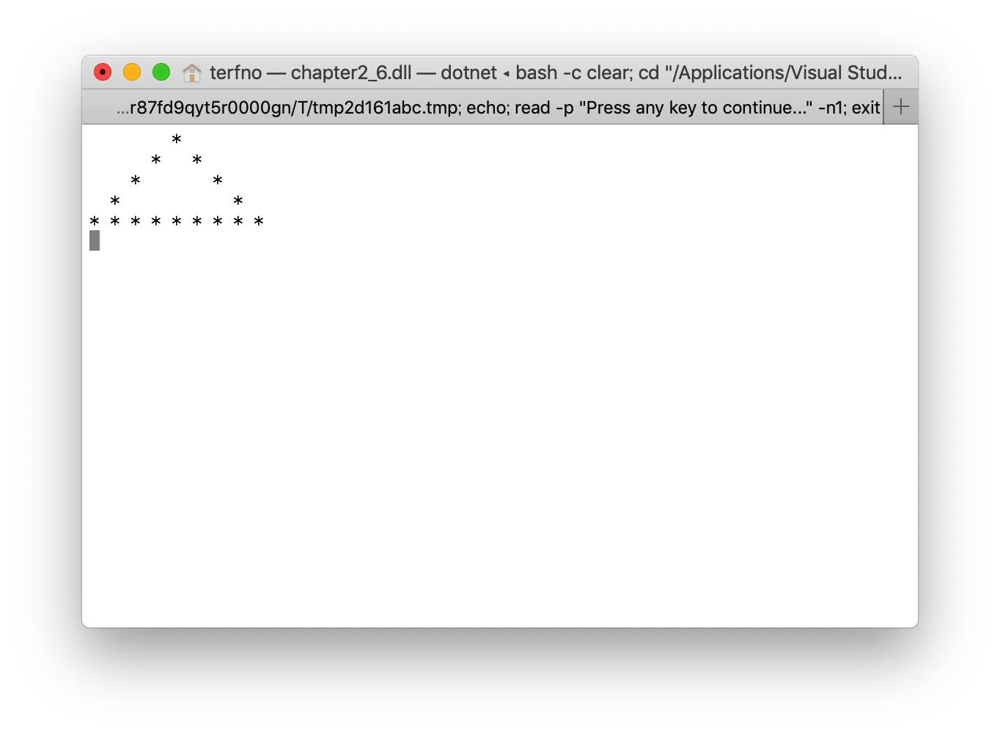
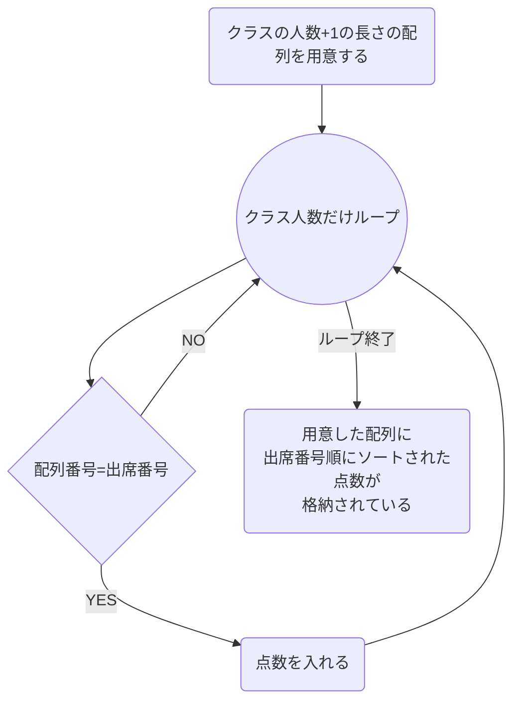

# 2019/04/19 プログラミング演習
<style>
    .center{
        text-align:center;
    }
</style>

## issue
* [ ] フローチャート

## 目的
この演習においては、デバッガの使い方とアルゴリズムの実装を行う。

## 装置/ツール
* Visual Studio
* MacBook Pro

## 実験
### 問題2.1
> 図2.2および図2.3の実行結果から想像して、PrintIntArrayメソッドを実装し、ソースコードを報告しなさい。

ソースコードを図2.1に示す。
```cs
static void PrintIntArray(int[] a)
{
    for(int i = 0; i < a.Length; i++)
    {
        Console.Write(a[i] + " ");
    }
    Console.WriteLine("");
}
```
<div class="center">図2.1 PrintIntArrayメソッドのソースコード</div>

### 問題2.2
> 問題2.1で実装したメソッドを図2.2のforループで使用する。

ソースコードを図2.2に示す。
```cs
using System;

namespace chapter2_1
{
    class Program
    {
        static int[] ReverseArray(int[] a, int stopIndex)
        {
            int[] revArray = new int[stopIndex];
            int i = a.Length - 1;
            for (int j = 0; j < stopIndex; j++)
            {
                revArray[j] = a[i];
                i--;
            }
            return revArray;
        }

        static void PrintIntArray(int[] a)
        {
            for(int i = 0; i < a.Length; i++)
            {
                Console.Write(a[i] + " ");
            }
            Console.WriteLine("");
        }

        static void Main(string[] args)
        {
            int[] a = new int[10] { 1, 3, 10, 4, 6, 5, 2, 8, 9, 7 };

            int[] revA = ReverseArray(a, 5);
            PrintIntArray(revA);
            Console.ReadKey();
        }
    }
}

```
<div class="center">
図2.2<br>
ReverseArrayメソッドを修正し、PrintIntArrayメソッドを組み込んだ<br>
プログラムのソースコード
</div>
<br>

実行結果を図2.2.1に示す。

<div class="center">
図2.2.1<br>
ReverseArrayメソッドを修正し、PrintIntArrayメソッドを組み込んだ<br>
プログラムの実行結果
</div>

### 問題2.3
> 実験書の図2.7の実行結果が図2.8になるようにPrintDoubleArrayメソッドを実装してソースコードを報告しなさい。

PrintDoubleArrayメソッドのソースコードを図2.3に示す。
```cs
private static void PrintDoubleArray(double[] d)
{
    for (int i = 0; i < d.Length; i++)
    {
        Console.Write(d[i] + " ");
    }
    Console.WriteLine("");
}
```
<div class="center">図2.3 PrintDoubleArrayメソッドのソースコード</div>

### 問題2.4
> 例外が発生する直前に書く変数が持っている値を前述した箇条書きの手順に則ってデバッガを使って表示し、スクリーンショットで報告しなさい。

変数が保持する値を表示したスクリーンショットを図2.4に示す。

<div class="center">図2.4 axisDataが持つ値を示したスクリーンショット</div>
<br>

### 問題2.5
> 実験書の図2.6で例外が発生しないように修正し、実行結果とソースコードを報告しなさい。

ソースコードを図2.5に示す。
```cs
using System;

namespace chapter2_3
{
    class Program
    {
        static double[] CreateXAxis(int n, double min, double max)
        {
            double tick = (max - min) / n;

            double[] axisData = new double[n];
            int tick_cnt = 0;

            for (double x = min; tick_cnt < n; x = Math.Truncate((x + tick) * 100.0) / 100.0)
            {
                axisData[tick_cnt] = x;
                tick_cnt++;
            }
            return axisData;
        }

        private static void PrintDoubleArray(double[] d)
        {
            for (int i = 0; i < d.Length; i++)
            {
                Console.Write(d[i] + " ");
            }
            Console.WriteLine("");
        }

        static void Main(string[] args)
        {
            double[] d = CreateXAxis(20, 1.0, 10.0);
            PrintDoubleArray(d);

            Console.ReadKey();
        }
    }
}

```
<div class="center">図2.5 例外が発生しないように修正したソースコード</div>
<br>

実行結果を図2.5.1に示す。

<div class="center">図2.5.1 1.0から10.0までを20で刻んだ値</div>

### 問題2.6
> PrintTriangleメソッドを動作させ、実行結果のスクリーンショットを報告しなさい。またデバッグを使ってなぜ実験書の図2.11のようにならないのか説明しなさい。

そのまま実行した際の実行結果を図2.6.1に示す。

<div class="center">図2.6.1 三角にならない実行結果</div>
<br>

if文の条件式が正しくないためこのようになってしまう。

### 問題2.7
修正したソースコードを図2.6.2に示す。
```cs
using System;

namespace chapter2_6
{
    class Program
    {
        static void PrintTriangle(int h)
        {
            int center = h / 2;
            for(int j = 0; j < h; j++)
            {
                for (int i = 0; i < h * 2; i++)
                {
                    if (center * 2 == j)
                    {
                        if (i == h*2-1)
                        {
                            break;
                        }
                        Console.Write("* ");
                    }
                    else if (center*2 + j == i || center*2 - j == i)
                    {
                        Console.Write("* ");
                    }
                    else
                    {
                        Console.Write("  ");
                    }
                }
                Console.WriteLine();
            }
        }

        static void Main(string[] args)
        {
            PrintTriangle(5);
            Console.ReadKey();
        }
    }
}

```
<div class="center">図2.6.2 修正したソースコード</div>
<br>

実行結果を図2.6.3に示す。

<div class="center">図2.6.3 いい感じに三角になった実行結果</div>

## 課題
### 課題2.1
> 浮動小数点数の仕組みについて調べなさい。
> また、図2.9で例外が発生した理由も合わせて答えなさい。

#### 浮動小数点数について
指数を使用することによって広い範囲の実数を一定の範囲内での相対誤差を許容することで近似して表現している。

#### 図2.9の例外について
for分の判定等に浮動小数点数を使用してしまったことで、微妙な誤差が積み重なり、配列の外を指定するに至った。

### 課題2.2
> バブルソート以外のソートを1種類調べ、フローチャートでアルゴリズムを記述しなさい。また、そのソートの特徴を説明しなさい。

バケットソートのフローチャートを考える。
今回は4-Cのある教科のテストの結果を出席番号がバラバラに記録されたものを出席番号順にソートするというものを考える。

フローチャートを図2.7.1と2.7.2に示す。
```

<div class="center">図2.7.1 mermaid.jsによるフローチャート</div>
<div class="center">

</div>
<div class="center">図2.7.2 mermaid.jsによるフローチャート</div>
