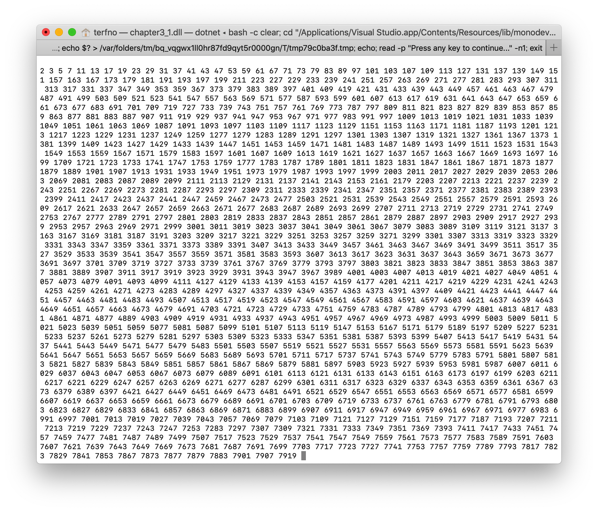
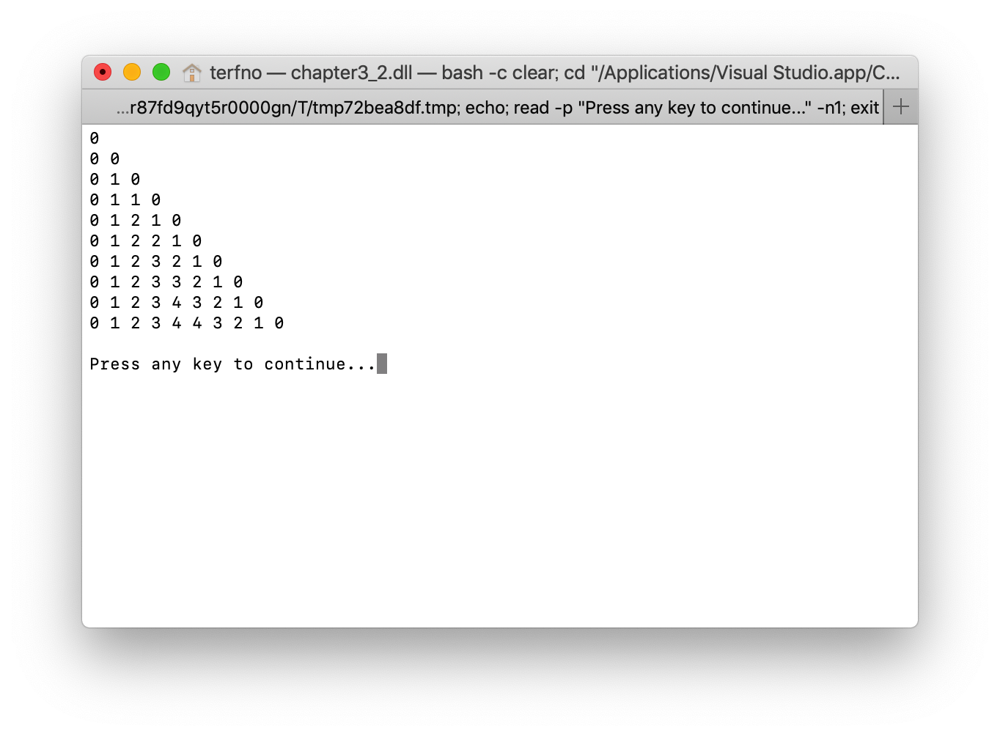
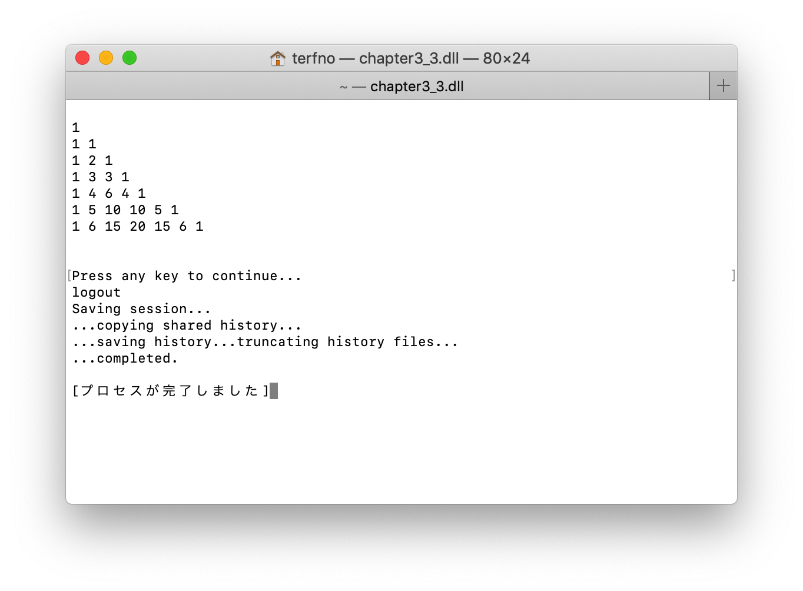
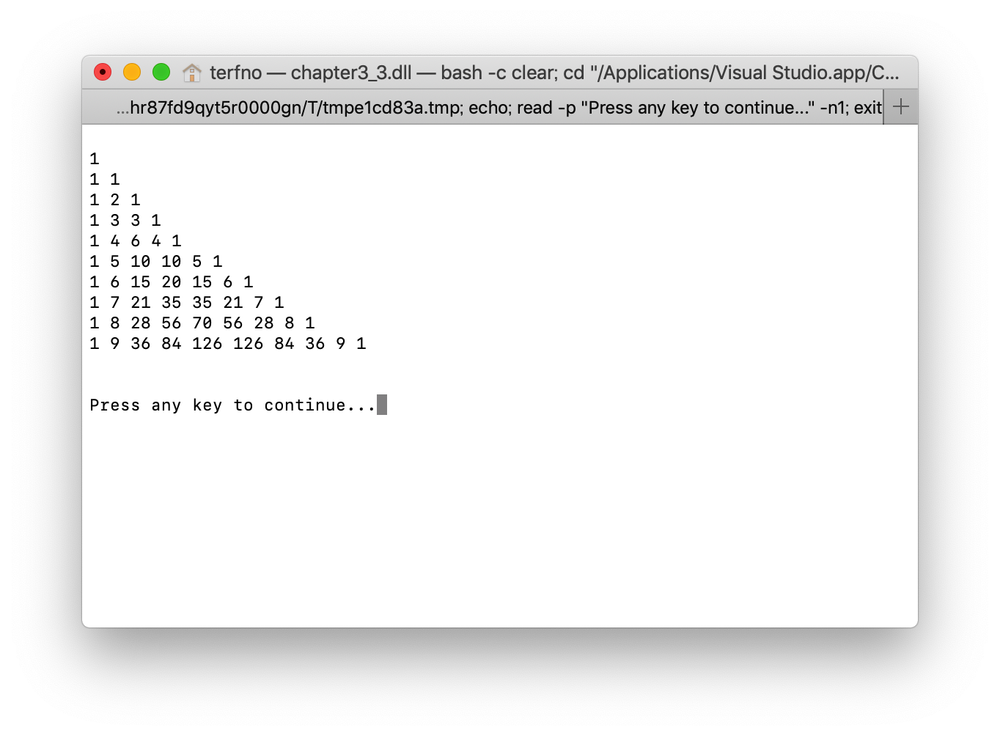

# 2019/04/26 プログラミング演習
<style>
    .center{
        text-align:center;
    }
</style>

## 目的
この演習においては構造化プログラミングについて触れる。

## 装置/ツール
* Visual Studio
* MacBook Pro

## 実験
### 問題3.1
> 1000個の素数を表示するプログラムを作成せよ。

ソースコードを図3.1.1に示す。
```cs
using System;

namespace chapter3_1
{
    class Program
    {
        static void Main(string[] args)
        {
            int di;
            int p = 0;
            for (int i = 1; i <= 8000; i++)
            {
                di = 0;

                for(int j = 1; j <= i; j++)
                {
                    if (i % j == 0)
                    {
                        di++;
                    }
                }

                if (di == 2)
                {
                    Console.Write(i + " ");
                    p++;
                    if (p == 1000)
                    {
                        break;
                    }
                }
            }

            Console.ReadKey();
        }
    }
}
```
<div class="center">図3.1.1 1000番目までの素数を表示するプログラム</div>
<br>

実行結果を図3.1.2に示す。

<div class="center">図3.1.2 1000番目までの素数を表示したターミナル</div>

### 問題3.2
> 実験書の図3.1のプログラムを作成し実行する。また、構造化手法に基づきプログラムを再構成せよ。

実験書のソースコードを図3.2.1に示す。
```cs
using System;

namespace chapter3_2
{
    class Program
    {
        static void Main(string[] args)
        {
            int n = 9, j = 0;
        First:
            int i = 0;
        Second:
            if (i <= j)
            {
                goto Fourth;
            }
            else
            {
                Console.Write("  ");
            }
        Third:
            if (i < n)
            {
                i++;
                goto Second;
            }
            Console.WriteLine();

            if (j < n)
            {
                j++;
                goto First;
            }
            else
            {
                return;
            }
        Fourth:
            if (i > j / 2)
            {
                Console.Write("{0} ", j - i);
            }
            else
            {
                Console.Write("{0} ", i);
            }
            goto Third;
        }
    }
}
```
<div class="center">図3.2.1 実験書のソースコード</div>
<br>

このソースコードの実行結果を図3.2.2に示す。

<div class="center">図3.2.2 実験書のソースコードの実行結果</div>
<br>

このソースコードを構造化手法に基づいて再構成したソースコードを図3.2.3に示す。
```cs
using System;

namespace chapter3_2
{
    class Program
    {
        static void Main(string[] args)
        {
            int n = 9;
            for(int j = 0; j < n; j++)
            {
                for (int i = 0; i < n; i++)
                {
                    if (i <= j)
                    {
                        if (i > j / 2)
                        {
                            Console.Write(j - i);
                        }
                        else
                        {
                            Console.Write(i);
                        }
                    }
                    else
                    {
                        Console.Write("  ");
                    }
                }
                Console.WriteLine();
            }
            return;
        }
    }
}
```
<div class="center">図3.2.3 再構成したソースコード</div>
<br>

実行結果を図3.2.4に示す。

<div class="center">図3.2.4 最高性したソースコードの実行結果</div>
<br>

### 問題3.3
> 高道祖hのパスカルの3活計を表示するプログラムを作成せよ。

ソースコードを図3.3.1に示す。
```cs
using System;

namespace chapter3_3
{
    class Program
    {
        static void Main(string[] args)
        {
            int h = 7;
            int[,] pascal = new int[h+2, h+2];
            for(int i = 1; i <= h; i++)
            {
                for(int j = 1; j <= h; j++)
                {
                    if (j == 1)
                    {
                        pascal[i, j] = 1;
                    }

                    if (j == i)
                    {
                        pascal[i, j] = 1;
                        break;
                    }
                    else
                    {
                        pascal[i, j] = pascal[i - 1, j - 1] + pascal[i - 1, j];
                    }
                }
            }

            for (int i = 0; i < pascal.GetLength(0); i++)
            {
                for(int j = 0; j < pascal.GetLength(1); j++)
                {
                    if (pascal[i, j] == 0)
                    {
                        continue;
                    }
                    Console.Write(pascal[i, j]+" ");
                }
                Console.WriteLine();
            }
        }
    }
}
```
<div class="center">図3.3.1 高さhのパスカルの三角形を表示するプログラム</div>

実行結果を図3.3.2と図3.3.3に示す。

<div class="center">図3.3.2 高さh=7の場合の実行結果</div>
<br>


<div class="center">図3.3.3 高さh=10の場合の実行結果</div>
<br>

## 課題
### 課題3.1
> 制御構造がからまりあったプログラムをなんというか

スパゲティコードという。~~クソだ~~

### 課題3.2
> 問題3.1をさらに洗練するならば何をするか

エラトステネスのふるいを利用して、判定する数を減らしていくことで実行時間を短縮できる。

### 課題3.3
> GoTo文の長所について調べなさい

goto文の深いネストのループやifを一発で抜けることができるという点は長所である。
