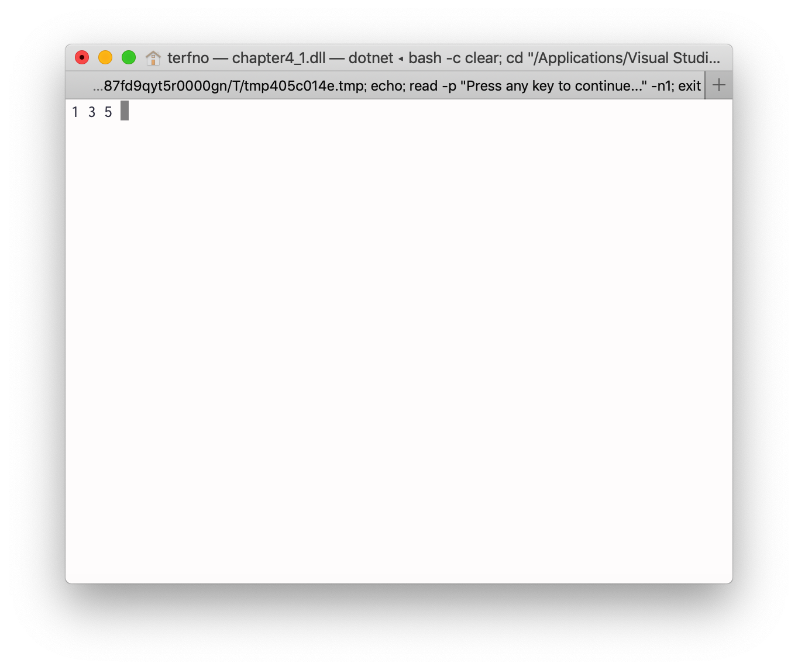

# 2019/05/10 プログラミング演習
<style>
    .center{
        text-align:center;
    }
</style>

## 目的
この演習においてはモジュールの結合度・凝集度について触れる。

## 装置/ツール
* Visual Studio
* MacBook Pro

## 実験
### 問題4.1
> 2つの配列の共通集合を表示するvoid IntersectAndPrint(int [], int[])関数を実験書図4.2と図4.3の実行結果を元に作成し、ソースコードを示しなさい。

IntersectAndPrint関数を図4.1に示す。
```cs
static void IntersectAndPrint (int[] a, int[] b)
{
    int[] dup = new int[a.Length];

    int dupCnt = 0;

    for(int j = 0; j < a.Length; j++)
    {
        if (Containe(dup, dupCnt, a[j]))
        {
            continue;
        }

        for (int i = 0; i < b.Length; i++)
        {
            if (a[j] == b[i])
            {
                dup[dupCnt] = a[j];
                dupCnt++;
            }
        }
    }

    for (int i = 0; i < dupCnt; i++)
    {
        Console.Write(dup[i] + " ");
    }
}
```
<div class="center">図4.1 IntersectAndPrint関数</div>

### 問題4.2
> 問題4.1で示されるIntersectAndPrint関数を機能的凝集度に照らし合わせて凝集度を高める。int[] intersect(int [], int[])関数とvoid Print(int[])関数に分割して実行するプログラムを新たに作成し、ソースコードを示しなさい。また実行結果をスクリーンショットで報告しなさい。

ソースコードを図4.2.1に示す。
```cs
using System;

namespace chapter4_1
{
    class Program
    {
        static bool Containe (int[] a, int aLen, int b)
        {
            for(int i = 0; i < aLen; i++)
            {
                if (a[i] == b)
                {
                    return true;
                }
            }
            return false;
        }

        static int[] Intersect(int[] a, int[] b)
        {
            int[] dup = new int[a.Length];

            int dupCnt = 0;

            for (int j = 0; j < a.Length; j++)
            {
                if (Containe(dup, dupCnt, a[j]))
                {
                    continue;
                }

                for (int i = 0; i < b.Length; i++)
                {
                    if (a[j] == b[i])
                    {
                        dup[dupCnt] = a[j];
                        dupCnt++;
                    }
                }
            }

            int[] ans = new int[dupCnt];
            for(int i = 0; i < dupCnt; i++)
            {
                ans[i] = dup[i];
            }

            return ans;
        }

        static void Print (int[] a)
        {
            for (int i = 0; i < a.Length; i++)
            {
                Console.Write(a[i] + " ");
            }
        }

        static void Main(string[] args)
        {
            int[] a1 = new int[5] { 1, 2, 3, 4, 5 };
            int[] a2 = new int[5] { 3, 1, 5, 10, 11 };

            Print(Intersect(a1, a2));

            Console.ReadKey();
        }
    }
}

```
<div class="center">図4.2.1 Print関数とIntersect関数に分割したソースコード</div>
<br>

実行結果を図4.2.2に示す。

<div class="center">図4.2.2 実行結果のスクリーンショット</div>


## 課題
### 課題4.1
> ソースコード中の2つの関数SwitchFlagとFuncArraysに対して、結合度の段階として何結合となっているか説明しなさい。
> また、結合度を下げるための提案をしなさい。

SwitchFlagがFuncArray内のflagを制御しているため、制御結合である。
結合度を下げる方法として

### 課題4.2
> 実験書図4.1のソースコードで示されているFuncArrays関数の凝集度を段階別に示すと何凝集度になるか説明しなさい。

if文を用いて処理の選択がなされているため論理的凝集度である。
