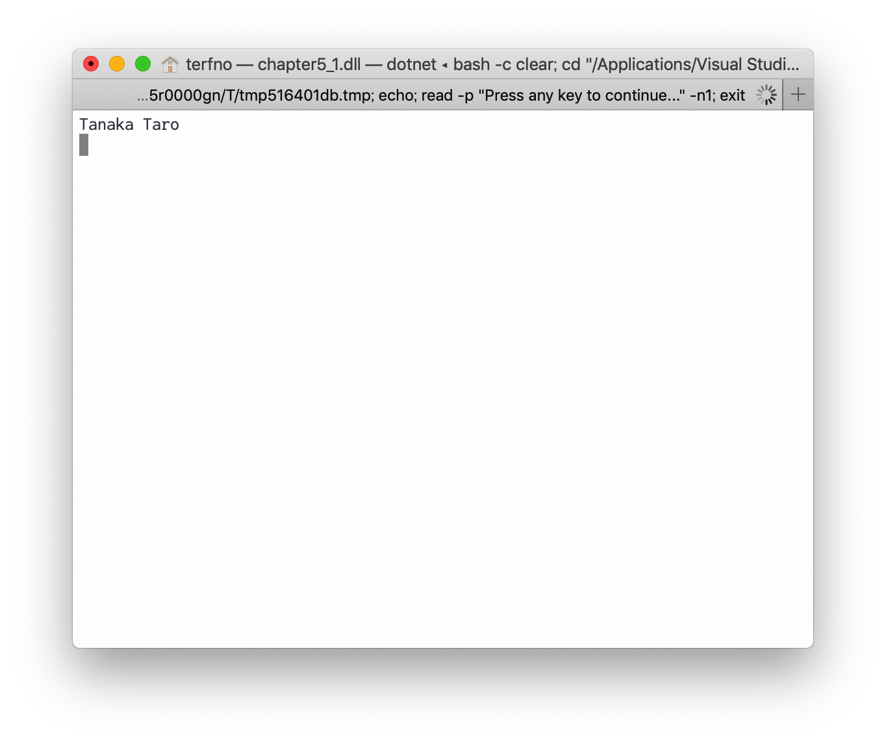
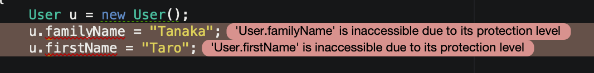
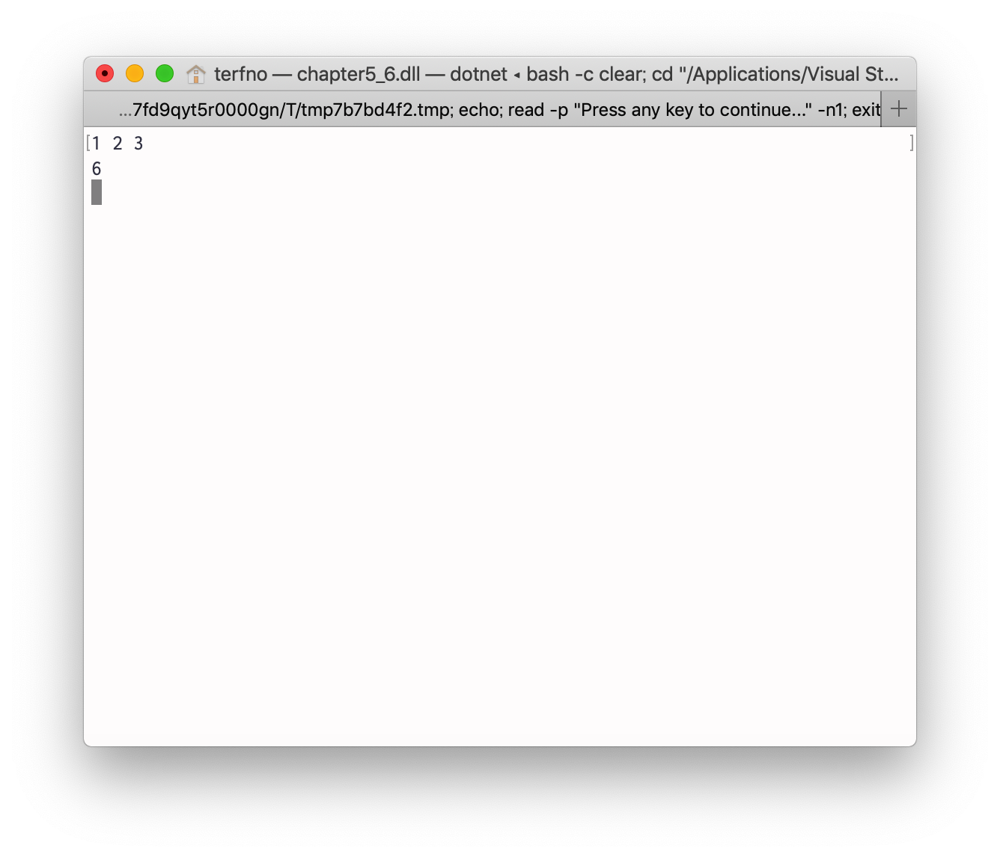

# 2019/05/17 プログラミング演習
<style>
    .c{
        text-align:center;
    }
</style>

## 目的
この演習においてはオブジェクト指向プログラミングの基礎について学ぶ。

## 装置/ツール
* Visual Studio
* MacBook Pro

## 実験
### 問題5.1
> 実験書図5.1のプログラムを作成し、ソースコードと実行結果を示しなさい。

`Program.cs`を図5.1.1に示す。
```cs
using System;
using chapter5_1;
using Records;

namespace chapter5_1
{
    class chapter5_1
    {
        static void Main(string[] args)
        {
            User u = new User();
            u.familyName = "Tanaka";
            u.firstName = "Taro";

            string uname = u.GetUserName();

            Console.WriteLine(uname);
            Console.ReadKey();
        }
    }

}
```
<div class="c">図5.1.1 Program.cs</div>
<br>

`User.cs`を図5.1.2に示す。
```cs
using System;

namespace Records
{
    public class User
    {
        public string familyName;
        public string firstName;
        public string GetUserName()
        {
            return familyName + " " + firstName;
        }
    }
}
```
<div class="c">図5.1.2 User.cs</div>
<br>

実行結果を図5.1.3に示す。

<div class="c">図5.1.3 実行結果</div>
<br>

### 問題5.2
> 図5.6のプログラムを作成および実行を行い、エラー内容を示しなさい。

エラー内容を図5.2.1に示す。

<div class="c">図5.2.1 エラー内容</div>
<br>

### 問題5.3
> 実験書図5.8に示すプログラムを作成し、実験書図5.2の実行結果と同じものになるようにMain関数を変更し、ソースコードとスクリーンショットを報告しなさい。

変更した`Program.cs`を図5.3.1に示す
```cs
using System;
using chapter5_1;
using Records;

namespace chapter5_1
{
    class chapter5_1
    {
        static void Main(string[] args)
        {
            User u = new User();

            u.SetUserName("Tnaka Taro");

            string uname = u.GetUserName();

            Console.WriteLine(uname);
            Console.ReadKey();
        }
    }

}
```
<div class="c">図5.3.1 変更したソースコード</div>
<br>

実行結果のスクリーンショットを図5.3.2に示す。

<div class="c">図5.3.2 実行結果</div>
<br>

### 問題5.4
> 実験書図5.13に示すCacheクラスをプロジェクトに追加し、図5.8のUserクラス内のSetUserName関数内で、実行するたびにわたされたnameを静的メンバーであるCache.nameに保存するように改変しなさい。またこのような静的メンバーを使うべきでない理由を調べなさい。

改変した`User.cs`を図5.4.1に示す。
```cs
using System;

namespace Records
{
    public class User
    {
        private string familyName;
        private string firstName;

        public void SetUserName(string name)
        {
            Cache.name = name;
            string[] nameParts = name.Split(' ');
            familyName = nameParts[0];
            firstName = nameParts[1];
        }

        public string GetUserName()
        {
            return familyName + " " + firstName;
        }
    }

    class Cache
    {
        public static string name = "";
    }
}
```
<div class="c">図5.4.1 改変したUser.cs</div>
<br>

#### 静的メンバーをつかうべきでない理由
静的メンバーは名前空間内に定義したグローバル変数やグローバル関数と大差ないため、オブジェクト指向プログラミングに反している。[^1]
[^1]:2019/05/17 https://teratail.com/questions/79536

### 問題5.5
> 実験書の図5.9、図5.10、図5.11、図5.12とfor文を組合せて、リスト構造の中身を表示するプログラムを作成し、ソースコードと実行結果をスクリーンショットで示しなさい。

`Program.cs`を図5.5.1に示す。
```cs
using System;
using System.Collections.Generic;

namespace chapter5_5
{
    class Program
    {
        static void Main(string[] args)
        {
            List<int> sampleList = new List<int>();

            sampleList.Add(3);
            sampleList.Add(1);
            sampleList.Add(4);
            sampleList.Add(1);
            sampleList.Add(5);

            for(int i = 0; i < sampleList.Count; i++)
            {
                Console.WriteLine(sampleList[i]);
            }
        }
    }
}
```
<div class="c">図5.5.1 組合せたソースコード</div>
<br>


実行結果を図5.5.2に示す。

<div class="c">図5.5.2 リスト構造の中身</div>
<br>

### 問題5.6
> 実験書図5.14に示す、Listクラスを使った総和を求めるプログラムを作成しソースコードと実行結果を報告しなさい。また、配列を使ったプログラムを変更してソースコードと実行結果を報告しなさい。さらに、Listクラスを使った場合のプログラムと配列を使った場合のプログラムの違いをデータ抽象化の観点から説明しなさい。

`Program.cs`を図5.6.1に示す。
```cs
using System;
using System.Collections.Generic;

namespace chapter5_6
{
    class Program
    {
        static void Main(string[] args)
        {
            List<int> nums = new List<int>();

            string input = Console.ReadLine();
            string[] terms = input.Split(' ');

            for(int i = 0; i < terms.Length; i++)
            {
                nums.Add(Convert.ToInt32(terms[i]));
            }

            int sum = 0;
            foreach(int n in nums)
            {
                sum += n;
            }

            Console.WriteLine(sum);
            Console.ReadKey();
        }
    }
}
```
<div class="c">図5.6.1 リストの中身を合計するプログラム</div>
<br>

実行結果を図5.6.2に示す。

<div class="c">図5.6.2 1+2+3をした実行結果</div>
<br>

配列で実装した場合のソースコードを図5.6.3に示す。
```cs
using System;

namespace chapter5_6
{
    class Program
    {
        static void Main(string[] args)
        {
            string input = Console.ReadLine();
            string[] terms = input.Split(' ');
            int[] nums = new int[terms.Length];

            for (int i = 0; i < terms.Length; i++)
            {
                nums[i] = Convert.ToInt32(terms[i]);
            }

            int sum = 0;
            foreach(int n in nums)
            {
                sum += n;
            }

            Console.WriteLine(sum);
            Console.ReadKey();
        }
    }
}
```
<div class="c">図5.6.3 配列の場合</div>
<br>

実行結果を図5.6.5に示す。

<div class="c">図5.6.5 1+2+3をした実行結果</div>
<br>

## 課題
### レポート課題5.1
> 概念と複数の実例の組合せを3つ述べなさい。

概念：年上の人を敬う
実例1：入り口から遠いところに偉い人を座らせる(上座の実例)
実例2：偉い人に敬語を使う
実例3：乾杯のときは目上の人のグラスより少し下げる

概念：輪廻転生
実例1：ダライ・ラマ
実例2：オウム真理教

概念：資本主義
実例：日本やアメリカ合衆国

### レポート課題5.2
> Main関数が静的メンバーである理由を調べなさい。

Main関数はプログラムのエントリーポイントであり、エントリーポイントは静的 (static) 関数でなければならないという取り決めがあるから。[^2] [^3]
[^2]:2019/05/24 https://teratail.com/questions/128153
[^3]:2019/05/24 https://ufcpp.net/study/csharp/structured/miscentrypoint/
