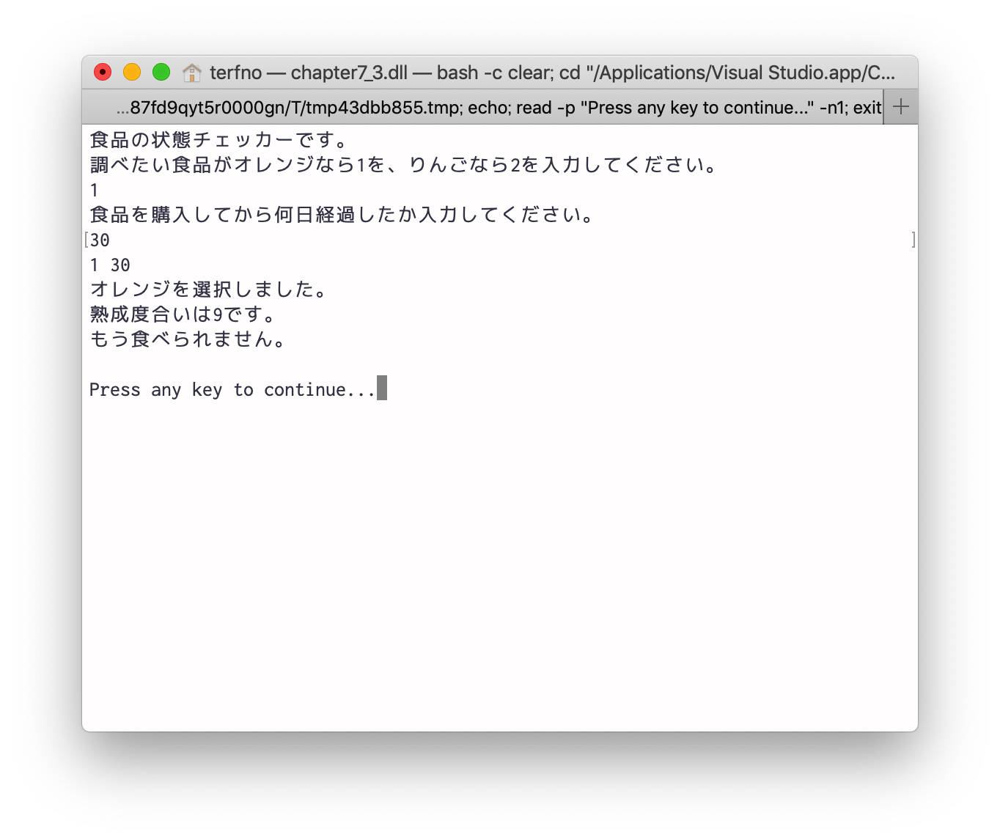

# 2019/05/31 プログラミング演習
<style>
    .c{
        text-align:center;
    }
</style>

## 目的
この演習においてはオブジェクト指向プログラミングの基礎であるクラスの継承について学ぶ。

## 装置/ツール
* Visual Studio
* MacBook Pro

## 実験
### 問題7.1
> 実験書図7.2として掲載しているクラス図をUMLモデリングソフトウェアを使って作成し報告しなさい。

GraphvizとDot言語で作成した。
コードを図7.1.1に示す。

<div class="c">図7.1.1 GraphvizとDot言語で記述</div>
<br>

生成されたクラス図を図7.1.2に示す。

<div class="c">図7.1.2 生成されたクラス図</div>

### 問題7.2
> 先週の実験にて独自に考えた具体的な概念と下位の概念を実装したプログラムのクラス図をUMLモデリングソフトウェアを使って作成し報告しなさい。

GraphvizとDot言語で作成した。
コードを図7.2.1に示す。

<div class="c">図7.2.1 GraphvizとDot言語で記述</div>
<br>

生成されたクラス図を図7.2.2に示す。

<div class="c">図7.2.2 生成されたクラス図</div>

### 問題7.3
> 実験書の図7.3のプログラムを作成し、実行結果を示しなさい。また多態性が使われている箇所を説明しなさい。

実行結果を図7.3.1に示す。

<div class="c">図7.3.1 実行結果</div>
<br>

`GetMaturity()`メソッドは多態性が使われている。
AppleとOrangeで痛むスピードが調整されている。

### 問題7.4
> 抽象的な概念と下位の具体的な概念を各自独自に考え、プログラムとして実装しなさい。そのソースコードと実行結果をスクリーンショットで報告しなさい。また、クラス図も作成し報告しなさい。

ソースコードを図7.4.1に示す。
```cs
using System;

namespace chapter7_4
{
    abstract class Car
    {
        private string carName;
        public int maxSpeed;

        public Car(string carName, int maxSpeed)
        {
            this.carName = carName;
            this.maxSpeed = maxSpeed;
        }

        public virtual string GetInfo()
        {
            return carName;
        }

        public abstract string GetSpeed();
    }

    class BrandCar : Car
    {
        private string brand; //e.g. Lamborghini, Ferrari

        public BrandCar(string brand, string carName, int maxSpeed) : base(carName, maxSpeed)
        {
            this.brand = brand;
        }

        public override string GetInfo()
        {
            return this.brand + " | " + base.GetInfo();
        }

        public override string GetSpeed()
        {
            return maxSpeed.ToString() + "km/h";
        }
    }

    class Track : Car
    {
        private int maxLC; //Maximum loading capacity

        public Track(int maxLC, string carName, int maxSpeed) : base(carName, maxSpeed)
        {
            this.maxLC = maxLC;
        }

        public override string GetInfo()
        {
            return "Maximum loading capacity:" + maxLC + " | " + base.GetInfo();
        }

        public override string GetSpeed()
        {
            return maxSpeed.ToString() + "km/h";
        }
    }

    class Program
    {
        public static void Main(string[] args)
        {
            BrandCar b = new BrandCar("Lamborghini", "huracan-evo", 325);
            Track t = new Track(2000, "dutro", 180);
            Car c1 = b;
            Car c2 = t;

            Console.WriteLine(c1.GetInfo() + ":" + b.GetSpeed());
            Console.WriteLine(c2.GetInfo() + ":" + t.GetSpeed());

            Console.ReadKey();
        }
    }
}

```
<div class="c">図7.4.1 ソースコード</div>
<br>

クラス図をGraphvizとDot言語で作成した。
コードを図7.4.2に示す。

<div class="c">図7.4.2 GraphvizとDot言語で記述</div>
<br>

生成されたクラス図を図7.4.3に示す。

<div class="c">図7.4.3 生成されたクラス図</div>
<br>

### 問題7.5
> 実験書図7.4のプログラムを作成し実行結果を示しなさい。またクラス図を作成しなさい。

実行結果を表7.5.1に示す。
<div class="c">表7.5.1</div>

実行結果を図7.5.1と図7.5.2に示す。
| 牛の一生シミュレーション |             |             | 
|--------------|-------------|-------------| 
| 生後1ヶ月        | 生後1ヶ月       | 生後1ヶ月       | 
| 牛乳美味しい       | 生後2ヶ月       | 牛乳美味しい      | 
| 生後2ヶ月        | 生後3ヶ月       | 生後2ヶ月       | 
| 牛乳美味しい       | 生後4ヶ月       | 牛乳美味しい      | 
| 生後3ヶ月        | 生後5ヶ月       | 生後3ヶ月       | 
| 牛乳美味しい       | 生後6ヶ月       | 牛乳美味しい      | 
| 生後4ヶ月        | 生後7ヶ月       | 生後4ヶ月       | 
| 牛乳美味しい       | 生後8ヶ月       | 牛乳美味しい      | 
| 生後5ヶ月        | 生後9ヶ月       | 生後5ヶ月       | 
| 牛乳美味しい       | 生後10ヶ月      | 牛乳美味しい      | 
| 生後6ヶ月        | 生後11ヶ月      | 生後6ヶ月       | 
| 牛乳美味しい       | 生後12ヶ月      | 牛乳美味しい      | 
| 生後7ヶ月        | 生後13ヶ月      | 生後7ヶ月       | 
| 牛乳美味しい       | 生後14ヶ月      | 牛乳美味しい      | 
| 生後8ヶ月        | 生後15ヶ月      | 生後8ヶ月       | 
| 牛乳美味しい       | 生後16ヶ月      | 牛乳美味しい      | 
| 生後9ヶ月        | 生後17ヶ月      | 生後9ヶ月       | 
| 牛乳美味しい       | 生後18ヶ月      | 牛乳美味しい      | 
| 生後10ヶ月       | 生後19ヶ月      | 生後10ヶ月      | 
| 牛乳美味しい       | 生後20ヶ月      | 牛乳美味しい      | 
| 生後11ヶ月       | 生後21ヶ月      | 生後11ヶ月      | 
| 牛乳美味しい       | ごちそうさまでした   | 牛乳美味しい      | 
| 生後12ヶ月       | お亡くなりになりました | 生後12ヶ月      | 
| 牛乳美味しい       |             | 牛乳美味しい      | 
| 生後13ヶ月       |             | 生後13ヶ月      | 
| 牛乳美味しい       |             | 牛乳美味しい      | 
| 生後14ヶ月       |             | 生後14ヶ月      | 
| 牛乳美味しい       |             | 牛乳美味しい      | 
| 生後15ヶ月       |             | 生後15ヶ月      | 
| 牛乳美味しい       |             | 牛乳美味しい      | 
| 生後16ヶ月       |             | 生後16ヶ月      | 
| 牛乳美味しい       |             | 牛乳美味しい      | 
| 生後17ヶ月       |             | 生後17ヶ月      | 
| 牛乳美味しい       |             | 牛乳美味しい      | 
| 生後18ヶ月       |             | 生後18ヶ月      | 
| 牛乳美味しい       |             | 牛乳美味しい      | 
| 生後19ヶ月       |             | 生後19ヶ月      | 
| 牛乳美味しい       |             | 牛乳美味しい      | 
| 生後20ヶ月       |             | 生後20ヶ月      | 
| 牛乳美味しい       |             | 牛乳美味しい      | 
| 生後21ヶ月       |             | 生後21ヶ月      | 
| 牛乳美味しい       |             | 牛乳美味しい      | 
| 生後22ヶ月       |             | 生後22ヶ月      | 
| 牛乳美味しい       |             | 牛乳美味しい      | 
| 生後23ヶ月       |             | 生後23ヶ月      | 
| 牛乳美味しい       |             | 牛乳美味しい      | 
| 生後24ヶ月       |             | 生後24ヶ月      | 
| 牛乳美味しい       |             | 牛乳美味しい      | 
| 生後25ヶ月       |             | 生後25ヶ月      | 
| 牛乳美味しい       |             | 牛乳美味しい      | 
| 生後26ヶ月       |             | 生後26ヶ月      | 
| 牛乳美味しい       |             | 牛乳美味しい      | 
| 生後27ヶ月       |             | 生後27ヶ月      | 
| 牛乳美味しい       |             | 牛乳美味しい      | 
| 生後28ヶ月       |             | 生後28ヶ月      | 
| 牛乳美味しい       |             | 牛乳美味しい      | 
| 生後29ヶ月       |             | 生後29ヶ月      | 
| 牛乳美味しい       |             | 牛乳美味しい      | 
| 生後30ヶ月       |             | 生後30ヶ月      | 
| 牛乳美味しい       |             | 牛乳美味しい      | 
| 生後31ヶ月       |             | 生後31ヶ月      | 
| 牛乳美味しい       |             | 牛乳美味しい      | 
| 生後32ヶ月       |             | 生後32ヶ月      | 
| 牛乳美味しい       |             | 牛乳美味しい      | 
| 生後33ヶ月       |             | 生後33ヶ月      | 
| 牛乳美味しい       |             | 牛乳美味しい      | 
| 生後34ヶ月       |             | 生後34ヶ月      | 
| 牛乳美味しい       |             | 牛乳美味しい      | 
| 生後35ヶ月       |             | 生後35ヶ月      | 
| 牛乳美味しい       |             | 牛乳美味しい      | 
| 生後36ヶ月       |             | 生後36ヶ月      | 
| 牛乳美味しい       |             | 牛乳美味しい      | 
| 生後37ヶ月       |             | 生後37ヶ月      | 
| 牛乳美味しい       |             | 牛乳美味しい      | 
| 生後38ヶ月       |             | 生後38ヶ月      | 
| 牛乳美味しい       |             | 牛乳美味しい      | 
| 生後39ヶ月       |             | 生後39ヶ月      | 
| 牛乳美味しい       |             | 牛乳美味しい      | 
| 生後40ヶ月       |             | 生後40ヶ月      | 
| 牛乳美味しい       |             | 牛乳美味しい      | 
| 生後41ヶ月       |             | 生後41ヶ月      | 
| 牛乳美味しい       |             | 牛乳美味しい      | 
| 生後42ヶ月       |             | 生後42ヶ月      | 
| 牛乳美味しい       |             | 牛乳美味しい      | 
| 生後43ヶ月       |             | 生後43ヶ月      | 
| 牛乳美味しい       |             | 牛乳美味しい      | 
| 生後44ヶ月       |             | 生後44ヶ月      | 
| 牛乳美味しい       |             | 牛乳美味しい      | 
| 生後45ヶ月       |             | 生後45ヶ月      | 
| 牛乳美味しい       |             | 牛乳美味しい      | 
| 生後46ヶ月       |             | 生後46ヶ月      | 
| 牛乳美味しい       |             | 牛乳美味しい      | 
| 生後47ヶ月       |             | 生後47ヶ月      | 
| 牛乳美味しい       |             | 牛乳美味しい      | 
| 生後48ヶ月       |             | 生後48ヶ月      | 
| 牛乳美味しい       |             | 牛乳美味しい      | 
| 生後49ヶ月       |             | 生後49ヶ月      | 
| 牛乳美味しい       |             | 牛乳美味しい      | 
| 生後50ヶ月       |             | 生後50ヶ月      | 
| 牛乳美味しい       |             | 牛乳美味しい      | 
| 生後51ヶ月       |             | 生後51ヶ月      | 
| 牛乳美味しい       |             | 牛乳美味しい      | 
| 生後52ヶ月       |             | 生後52ヶ月      | 
| 牛乳美味しい       |             | 牛乳美味しい      | 
| 生後53ヶ月       |             | 生後53ヶ月      | 
| 牛乳美味しい       |             | 牛乳美味しい      | 
| 生後54ヶ月       |             | 生後54ヶ月      | 
| 牛乳美味しい       |             | 牛乳美味しい      | 
| 生後55ヶ月       |             | 生後55ヶ月      | 
| 牛乳美味しい       |             | 牛乳美味しい      | 
| 生後56ヶ月       |             | 生後56ヶ月      | 
| 牛乳美味しい       |             | 牛乳美味しい      | 
| 生後57ヶ月       |             | 生後57ヶ月      | 
| 牛乳美味しい       |             | 牛乳美味しい      | 
| 生後58ヶ月       |             | 生後58ヶ月      | 
| 牛乳美味しい       |             | 牛乳美味しい      | 
| 生後59ヶ月       |             | 生後59ヶ月      | 
| 牛乳美味しい       |             | 牛乳美味しい      | 
| 生後60ヶ月       |             | 生後60ヶ月      | 
| 牛乳美味しい       |             | 牛乳美味しい      | 
| 生後61ヶ月       |             | 生後61ヶ月      | 
| 牛乳美味しい       |             | 牛乳美味しい      | 
| お亡くなりになりました  |             | お亡くなりになりました | 

クラス図をGraphvizとDot言語で作成した。
コードを図7.5.2に示す。

<div class="c">図7.5.2</div>
<br>

生成されたクラス図を図7.5.3に示す。

<div class="c">図7.5.3</div>
<br>

### 問題7.6
> 複数の上位概念に所属する下位概念について2組をほど列挙しなさい。

パンダ:肉食と草食の2つの上位概念

カモノハシ:鳥類と爬虫類と哺乳類の上位概念

## 課題
### レポート課題7.1
> 多重継承のメリットおよび望ましくない点を調べて報告しなさい。

#### メリット
多重継承することで、コードが短くなったり、読みやすくなることがある。

#### 望ましくない点
親クラスAを継承したBとCというクラスが存在したとき、多重継承でBとCを継承したDというクラスのAとの関係が面倒くさくなる所謂菱形問題が発生する。
一般的な回避策がなくJAVA7までが多重継承を採用しない理由の1つ。

### レポート課題7.2
> インターフェースと抽象クラスのメリット・デメリットを調べて報告しなさい。

#### メリット
仕様を型として使いまわしたり、処理を使い回すことができて、コードが美しくなる。

#### デメリット
適切に使用できなかった場合、コードが冗長になることがある。
