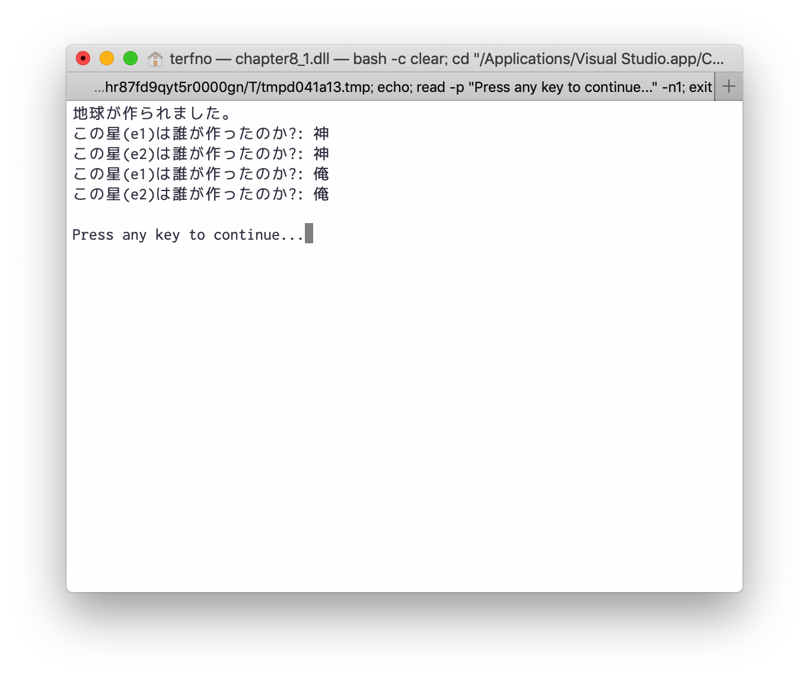
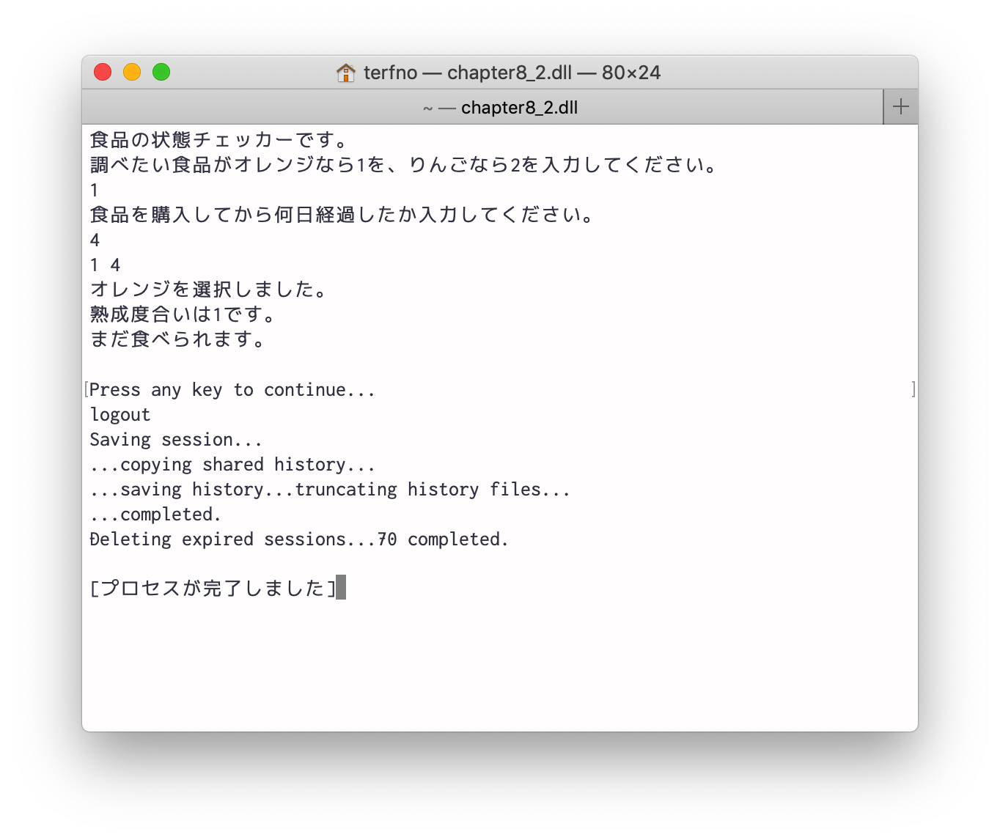
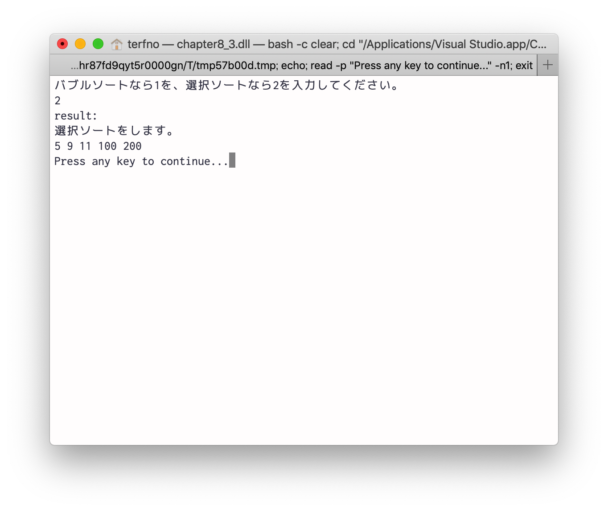
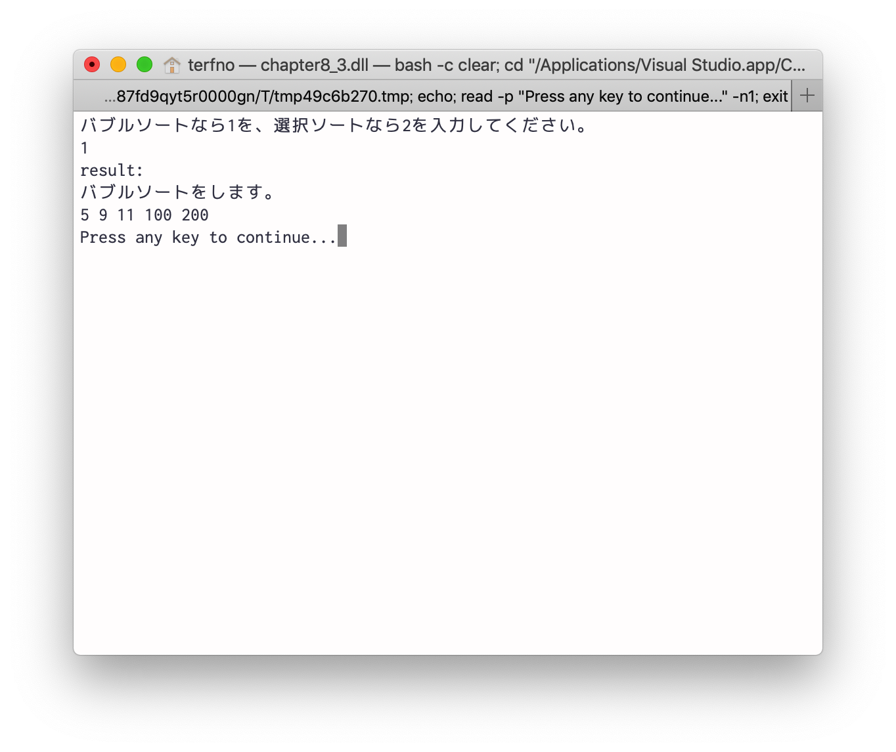
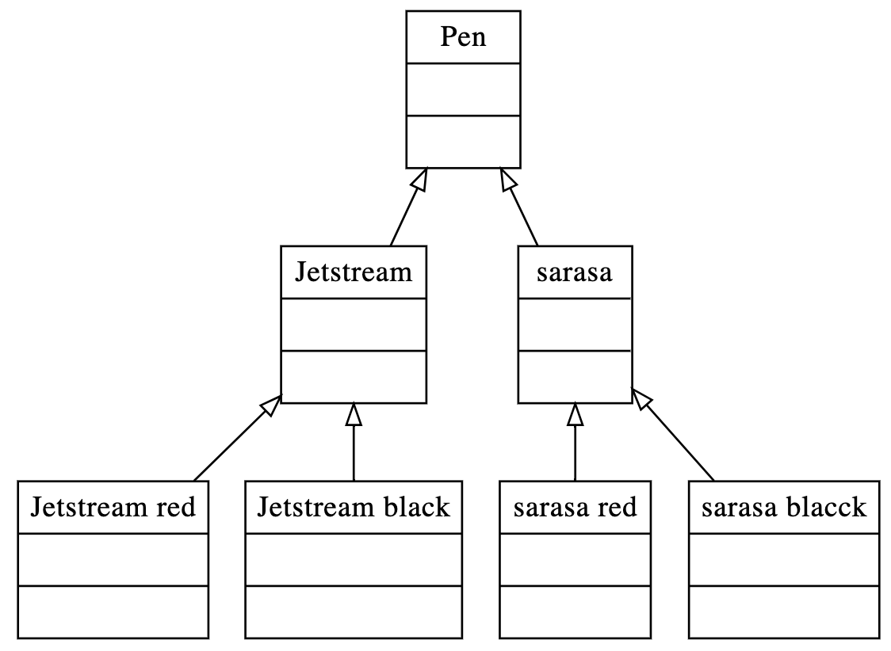
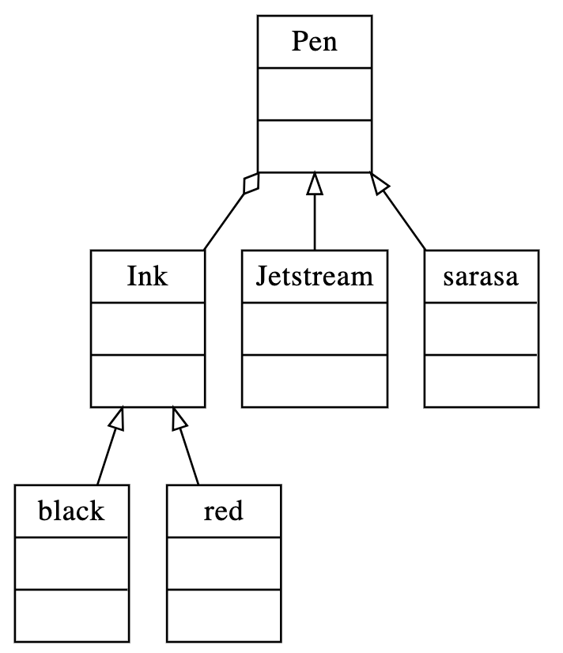
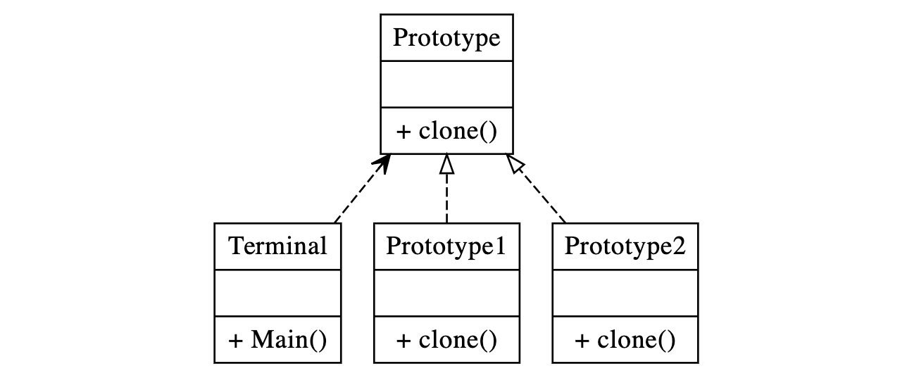

# 2019/06/21 プログラミング演習
<style>
    .c{
        text-align:center;
    }
</style>

## 目的
この演習においてはオブジェクト指向プログラミングにおける設計方針の基礎について学ぶ。

## 装置/ツール
* Visual Studio
* MacBook Pro

## 実験
### 問題8.1
> 実験書図8.2のプログラムを作成し、ソースコードと実行結果を報告しなさい。また、なぜgetInstanceメソッドを複数回呼び出してもインスタンスが変化しないのか説明しなさい。

ソースコードを図8.1.1に示す。
```cs
using System;

namespace chapter8_1
{
    public class Earth
    {
        private static Earth own = null;

        private string creator;

        private Earth()
        {
            Console.WriteLine("地球が作られました。");
        }

        public static Earth getInstance()
        {
            if(Earth.own == null)
            {
                Earth.own = new Earth();
                Earth.own.creator = "神";
            }

            return Earth.own;
        }

        public string getCreatorName()
        {
            return this.creator;
        }

        public void setCreatorName(string gname)
        {
            this.creator = gname;
        }
    }

    public class Terminal
    {
        public static void Main(string[] args)
        {
            Earth e1 = Earth.getInstance();
            Console.WriteLine("この星(e1)は誰が作ったのか?: {0}", e1.getCreatorName());

            Earth e2 = Earth.getInstance();
            Console.WriteLine("この星(e2)は誰が作ったのか?: {0}", e2.getCreatorName());

            e1.setCreatorName("俺");

            Console.WriteLine("この星(e1)は誰が作ったのか?: {0}", e1.getCreatorName());
            Console.WriteLine("この星(e2)は誰が作ったのか?: {0}", e2.getCreatorName());
        }
    }
}

```
<div class="c">図8.1.1 ソースコード</div>
<br>

実行結果を図8.1.2に示す。

<div class="c">図8.1.2 実行結果</div>
<br>

Singletonパターンだから

### 問題8.2
> 実験書図8.4のプログラムを実装しスクリーンショットを報告しなさい。また、Factory Methodパターンに該当するクラスを列挙し、パターンのどのクラスに対応するか説明しあんさい。

実行結果を図8.2.1に示す。

<div class="c">図8.2.1 実行結果</div>
<br>

Factory Methodパターンに対応するクラス
* FoodFactory
* CompanyA
* CompanyB
* Food
* Apple
* Orange

### 問題8.3
> Strategy パターンを使って、配列をソートするアルゴリズムを選択でき、加えてソート結果を表示するプログラムを作成しなさい。

ソースコードを図8.3.1に示す。
```cs
using System;

namespace chapter8_3
{
    public interface Sorting
    {
        // int型の配列を返すメソッド
        int[] Sort(int[] array);
    }

    // バブルソート
    public class Bubble : Sorting
    {
        public int[] Sort(int[] array)
        {
            Console.WriteLine("バブルソートをします。");
            int[] nums = array;
            int start, end, tmp;

            for (start = 1; start < nums.Length; start++)
            {
                for (end = nums.Length - 1; end >= start; end--)
                {
                    if (nums[end - 1] > nums[end])
                    {
                        tmp = nums[end - 1];
                        nums[end - 1] = nums[end];
                        nums[end] = tmp;
                    }
                }
            }

            return nums;
        }
    }

    // 選択ソート
    public class Selection : Sorting
    {
        public int[] Sort(int[] array)
        {
            Console.WriteLine("選択ソートをします。");
            int[] nums = array;
            int n = nums.Length;
            int minj = 0;

            for (int i = 0; i < n; i++)
            {
                minj = i;
                for (int j = minj; j < n; j++)
                {
                    if (nums[j] < nums[minj])
                    {
                        minj = j;
                    }
                }
                int tmp = nums[i];
                nums[i] = nums[minj];
                nums[minj] = tmp;
            }

            return nums;
        }
    }

    // ソートするアルゴリズムのコンテクスト
    public class Algo
    {
        private static Sorting _rithm;

        public int[] Sort(string type, int[] array)
        {
            if (type == "1")
            {
                _rithm = new Bubble();
            }
            else if(type == "2")
            {
                _rithm = new Selection();
            }
            else
            {
                Console.WriteLine("不正な入力です。ソートしませんでした。");
                return array;
            }

            return _rithm.Sort(array);
        }
    }

    public class Program
    {
        static void Main(string[] args)
        {
            int[] array = new int[5] { 11, 5, 9, 100, 200 };
            Console.WriteLine("バブルソートなら1を、選択ソートなら2を入力してください。");
            string type = Console.ReadLine();

            Algo _algorithm = new Algo();
            Console.WriteLine("result:");

            int[] result = _algorithm.Sort(type, array);

            for (int i=0;i<result.Length; i++)
            {
                Console.Write(result[i] + " ");
            }
        }
    }
}
```
<div class="c">図8.3.1 ソースコード</div>
<br>

実行結果を図8.3.2と図8.3.3に示す。

<div class="c">図8.3.2 実行結果</div>
<br>


<div class="c">図8.3.3 実行結果</div>
<br>

## 課題
### レポート課題8.1
> 今回紹介したデザインパターン以外で、GoFのデザインパターンを3つ調べてどのようなクラス設計になるのかクラス図を示し、利用すべき状況と利用によって生まれる利点を示しなさい。

今回使用したデザインパターンは以下の3つで、SingletonとFactory Methodは生成に係るデザインパターン、Strategyは振る舞いに関するデザインパターンである。
* Singleton
* Factory Method
* Strategy

#### Bridge
構造に係るデザインパターンとして、Bridgeがある。
クラスの中に複数の継承関係が存在する際に、それぞれを分離して考えることができる。そうすることでそれぞれのクラスを拡張することが容易になりクラス数も減らすことができる。
Bridgeのデザインパターンを適用する前のクラス図を図8.4.1.1に示す。適用後を図8.4.1.2に示す。
<!-- ```graphviz
digraph obj{
    node[shape=record];
    rankdir="BT"
    
    pen [label="{
    Pen||
    }"];
    
    jet [label="{
    Jetstream||
    }"]
    
    jet_r [label="{
    Jetstream red||
    }"]
    
    jet_b [label="{
    Jetstream black||
    }"]
    
    sarasa [label="{
    sarasa||
    }"]
    
    sarasa_r [label="{
    sarasa red||
    }"]
    
    sarasa_b [label="{
    sarasa blacck||
    }"]
    
    edge [arrowhead = "empty"]
    jet_r -> jet
    jet_b -> jet
    jet -> pen
    sarasa_r -> sarasa
    sarasa_b -> sarasa
    sarasa -> pen
}
``` -->

<div class="c">図8.4.1.1 Bridgeデザインパターン適用前</div>

<!-- ```graphviz
digraph obj{
    node[shape=record];
    rankdir="BT";
    
    pen [label="{
    Pen||
    }"];
    
    ink [label="{
    Ink||
    }"]
    
    jet [label="{
    Jetstream||
    }"]
    
    sarasa [label="{
    sarasa||
    }"]
    
    black [label="{
    black||
    }"]
    
    red [label="{
    red||
    }"]
    
    edge [arrowhead = "odiamond"]
    ink -> pen
    
    edge [arrowhead = "empty"]
    jet -> pen
    sarasa -> pen
    black -> ink
    red -> ink
}
``` -->


<div class="c">図8.4.1.2 Bridgeデザインパターン適用後</div>

#### Future
マルチスレッドプログラミングに係るデザインパターンとしてFutureがある。JSのPromiseみたいな感じ。(カール・ヒューイットはPromiseという表現よりFutureが適切だと述べているらしい。)
Futureのクラスはインターフェースとして実装される。
クラス図を図8.4.2に示す。
<!-- ```graphviz
digraph obj{
    node[shape=record];
    rankdir="BT";
    
    future [label ="{
    Future||
    }"]
    
    class [label ="{
    Something||
    }"]
    
    edge [arrowhead = "empty" style="dashed"]
    class -> future
}
``` -->

<div class="c">図8.4.2 Futureデザインパターンを使用した例</div>

#### Prototype
生成に係るデザインパターンとしてPrototypeがある。
生成されるオブジェクトが典型的なインスタンスである場合に使用する。このオブジェクトを複製してさらにオブジェクトを作る。
<!-- ```graphviz
digraph obj{
    node[shape=record];
    rankdir="BT"
    
    term[label="{
    Terminal||
    + Main()
    }"]
    
    proto[label="{
    Prototype||
    + clone()
    }"]
    
    proto_1[label="{
    Prototype1||
    + clone()
    }"]
    
    proto_2[label="{
    Prototype2||
    + clone()
    }"]
    
    edge [arrowhead = "vee" style="dashed"]
    term -> proto
    
    edge [arrowhead = "empty" style="dashed"]
    proto_1 -> proto
    proto_2 -> proto
}
``` -->


<div class="c">図8.4.3 Prototypeデザインパターンを使用した例</div>

### レポート課題8.2
> インターフェース分離の原則において、インターフェースはどのように設計すべきか、調べてまとめなさい。

インターフェイス分離の原則とは、クライアントが使用しないメソッドに依存するよう強制されるべきではないということ。つまりインターフェイスはミニマムに用意しておいて、別途必要な場合は継承によって分離されたインターフェイスを用意するというスタイルでの設計が推奨されている。

### レポート課題8.3
> SOLID原則に基づいて、図8.4のプログラムの改良すべき点を説明しなさい。

依存関係逆転の原則に則って改良できる。現時点ではFoodクラスやFoodFactoryクラスの変更が子クラスのCompanyAや、Appleに影響している。
